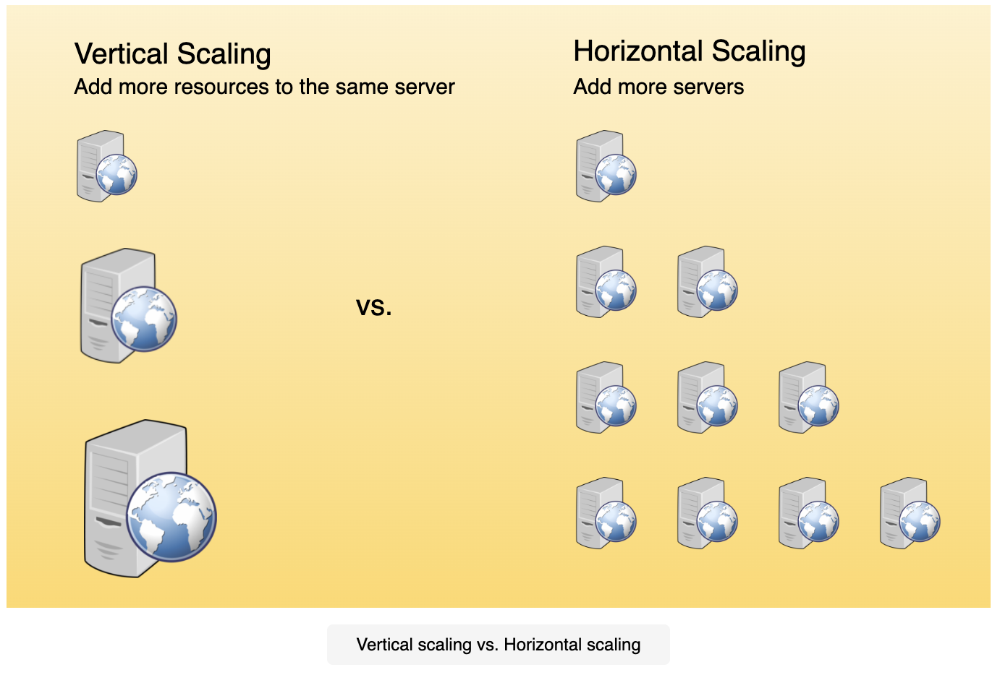
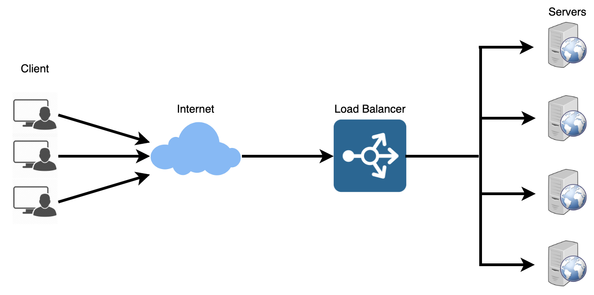
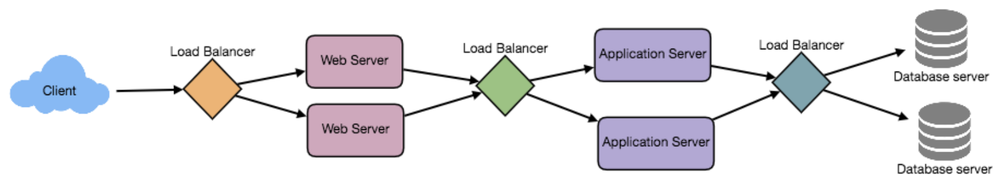
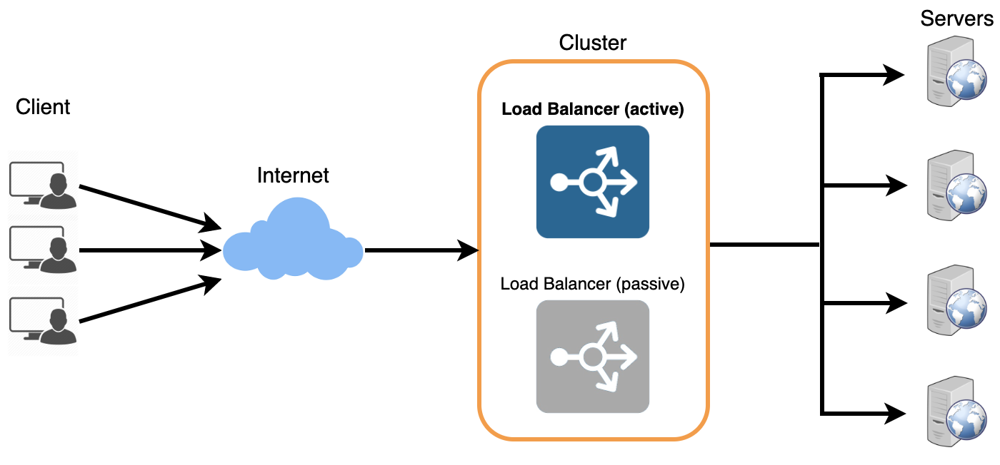
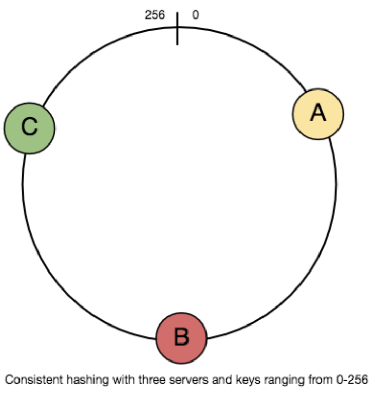

# Glossary

### 01. Basics
### 02. Distributed Systems
### 03. Load Balancing
### 04. Caching
### 05. Data Partitioning
### 06. Indexes
### 07. Proxies
### 08. Redundancy and Replication
### 09. SQL vs. NoSQL
### 10. CAP Theorem
### 11. Consistent Hashing

# 01. Basics

Whenever designing a large system, need to consider a few things:

1. What are the different architectural pieces that can be used?
2. How do these pieces work with each other?
3. How can we best utilize these pieces: good tradeoffs?

**Terms:**

- Consistent Hashing
- CAP Theorem
- Load Balancing
- Caching
- Data Partitioning
- Indexes
- Proxies
- Queues
- Replication
- SQL vs. NoSQL

# 02. Key Characteristics of Distributed Systems

## Scalability

Scalability is the capability of a system, process, or a network to grow and manage increased demand. A system may have to scale because of many reasons like increased data volume or increased amount of work, e.g., number of transactions. Generally, the performance of a system, althgouh designed (or claimed) to be scalable, declines with the system due to the management or environment cost.

**Horizontal vs. Vertical Scaling:** Horizontal scaling means that you scale by adding more servers into your pool of resources, whereas vertical scaling means that you scale by adding more power (CPU, RAM, storage, etc.) to an existing server. Good examples of horizontal scaling are Cassandra and MongoDB as they both provide an easy way to scale horizontally by adding more machines to meet growing needs. Similarly, a good example of vertical scaling is MySQL as it allows for an easy way to scale vertically by switching from smaller to bigger machines, however this process often involves downtime.

---

## Reliability

Reliability is the probability a system will fail in a given period. Take the example of a large electronic commerce store (like Amazon), where one of the primary requirements is that any user transaction should never be cancelled due to a failure of the machine that is running that transaction. For instance, if a user has added an item to their shopping cart, the system is expected not to lose it. If the server carrying the user's shopping cart fails, another server that has the exact replica of the shopping cart should replace it.

---

## Availability

Availability is the time a system remains operational to perform its required function in a specific period. Reliability is availability over time considering the full range of possible real-world conditions that can occur.

**Reliability vs. Availability:** If a system is reliable, it is available, however, if it is available, it is not necessarily reliable. Let's take the example of an online retail store that has 99.99% availability for the first 2 years after its launch, however, the system was launched without any information security testing. The customers are happy with the system, but they don't realize that it isn't very reliable as it is vulnerable to likely risks. In the 3rd year, the system experiences security incidents.

---

## Efficiency

Efficiency can be measured as the response time (latency) that denotes the delay to obtain the first item, and the throughput (or bandwidth) which denotes the number of items delivered in a given time unit (e.g., a second). The 2 measures correspond to:

- Number of messages globally sent by the nodes of the system.
- Size of messages representing the volume of data exchanges.

The complexity of operations supported by distributed data structures (e.g., searching for a specific key in a distributed index) can be characterized as a function of one of these cost units.

---

## Manageability

Manageability is how easy it is to operate and maintain. It is the simplicity and speed with which a system can be repaired or maintained. Early detection of faults can decrease or avoid system downtime. For example, some enterprise systems can automatically call a service center when the system experiences a system fault.

---

# 03. Load Balancing

Load balancing helps to spread the traffic across a cluster of servers to improve responsiveness and availability of applications, websites, or databases. Typically a load balancer sits between the client and the server accepting incoming network and application traffic and distributing the traffic across multiple backend servers using various algorithms.

To utilize full scalability and redundancy, we can try to balance the load at each layer of the system. We can add LBs at 3 places:

- Between the user and the web server.
- Between the web servers and an internal platform layer, like application servers or cache servers.
- Between internal platform layer and database.

---

## Benefits of Load Balancing

- Users experience faster, uninterrupted service.
- Service providers experience less downtime and higher throughput.
- Load balancing makes it easier for system administrators to handle incoming requests which decreasing wait time for users.
- Smart load balancers provide benefits like predictive analytics that determine traffic bottlenecks before they happen.
- System administrators experience fewer failed or stressed components.

---

## Load Balancing Algorithms

**How does the load balancer choose the backend server?**
Load balancers consider 2 factors before forwarding a request to a backend server. They will first ensure that the server they choose is actually responding to requests, and then use a pre-configured algorithm to select one from the set of healthy servers.

**Health Checks:** Load balancers should only forward traffic to "healthy" backend servers. There is a variety of load balancing methods:

- **Least Connection Method:** Directs traffic to the server with the fewest active connections.
- **Least Response Time Method:** Directs traffic to the server with the fewest active connections and the lowest average response time.
- **Least Bandwidth Method:** Selects the server that is currently serving the least amount of traffic measured in Mbps.
- **Round Robin Method:** Cycles through a list of servers and sends each new request to the next server.
- **Weighted Round Robin Method:** Each server assigned a weight, servers with higher weights receive new connections before those with less weights.
- **IP Hash:** A hash of the IP address of the client is calculated to redirect the request to a server.

---

## Redundant Load Balancers

The load balancer can be a single point of failure; to overcome this,
a second load balancer can be connected to the first to form a cluster.

---

# 04. Caching

Caching enables us to make vastly better use of the resources we already have as well as making otherwise unattainable product requirements feasible. Caches take advantage of the locality of reference principle: recently requested data is likely to be requested again. A cache is like short-term memory: it has a limited amount of space, but is typically faster than the original data source and contains the most recently accessed items.

___

## Application Server Cache

Placing a cache directly on a request layer node enables the local storage of response data. Each time a request is made to the service, the node will quickly return local cached data if it exists. Expanding this to many nodes increases cache misses, 2 choices for overcoming this hurdle are global caches and distributed caches.

___

## Content Distribution Network (CDN)

CDNs are a kind of cache that comes into play for sites serving large amounts of static media. In a typical CDN setup, a request will first ask the CDN for a piece of static media; the CDN will serve that content if it has it locally available. If it isn't available, the CDN will query the backend servers for the file, cache it locally, and servce it to the requesting user.

___

## Cache Invalidation

If the data is modified in the database, it should be invalidated in the cache; if not, this can cause inconsistent application behavior. There are 3 main schemes that are used:

**Write-Through Cache:** Data is written into the cache and the corresponding database at the same time.

**Write-Around Cache:** Data is written directly to permanent storage, bypasssing the cache.

**Write-Back Cache:** Data is written to cache alone and completion is immediately confirmed to the client.

___

## Cache Eviction Policies

Most common cache eviction policies:

1. First In First Out (FIFO): Cache evicts the first block accessed first without any regard to how often or how many times it was accessed before.
2. Last In First Out (LIFO): The cache evicts the block accessed most recently first without any regard to how often or how many times it was accessed before.
3. Least Recently Used (LRU): Discards the least recently used items first.
4. Most Recently Used (MRU): Discards, in contrast to LRU, the most recently used items first.
5. Least Frequently Used (LFU): Counts how often an item is needed. Those that are used least often are discarded first.
6. Random Replacement (RR): Randomly selects a candidate item and discards it to make space when necessary.

---

# 05. Data Partitioning

Data partitioning is a technique to break up a big database (DB) into many smaller parts. It is the process of splitting up a DB/table across multiple machines to improve the manageability, performance,availability, and load balancing of an application.

___

## 1. Partitioning Methods

There are many different schemes one could use to decide how to break up an application database into multiple smaller DBs.

**a. Horizontal Partitioning:** Put different rows into different tables.
For example, if we are storing different places in a table, we can decide that locations with ZIP codes less than 10,000 are stores in one table, and places with ZIP codes greater than 10,000 are stored in a separate table. This is also known as data sharding.

**b. Vertical Partitioning:** Divide data to store tables related to a specific feature in their own server. For example, if we are building an Instagram-like application - where we need to store data related to users, photos they upload, and people they follow - we can decide to place user profile information on one DB server, friends list on another, and photos on a 3rd server.

**c. Directory Based Partitioning:** Create a lookup service which knows your current partitioning scheme and abstracts it away from the DB access code. So, to find out where a particular data entry resides, we query the directory server that holds the mapping between each tuple key to its DB server.

___

## 2. Partitioning Criteria

**a. Key or Hash-Based Partitioning:** Apply a hash function to some key attributes of the entity we are storing; that yields the partition number.

**b. List Partitioning:** Each partition is assigned a list of values, so whenever we want to insert a new record, we will see which partition contains our key and then store it there.

**c. Round-Robin Partitioning:** There is a very simple strategy that ensures uniform data distribution. With 'n' partitions, the 'i' tuple is assigned to partition (i mod n).

**d. Composite Partitioning:** Combine any of the above partitioning schemes to devise a new scheme. Consistent hashing could be considered a composite of hash and list partitioning where the hash reduces the key space to a size that can be listed.

___

## 3. Common Problems of Data Partitioning

Some constraints/additional complexities introduced by partitioning:

**a. Joins and Denormalization:** Performing joins on a database which is running on one server is straightforward, but once a database is partitioned and spread across multiple machines, it is often not feasible to perform joins that span database partitions.

**b. Referential Integrity:** Trying to enforce data integrity constraints such as foreign keys in a partitioned database can be difficult. Most of RDBMS do not support foreign key constraints across databases on different database servers, applications have to run regular SQL jobs to clean up dangling references.

**c. Rebalancing:** There could be many reasons to change our scheme:
1. The data distribution is not uniform.
2. There is a lot of load on a partition.

Have to rebalance existing partitions, which means the partitioning scheme changed and all existing data moved to new locations.

---

# 06. Indexes

The goal of creating an index on a particular table in a database is to make it faster to search through the table and find the row or rows that we want. Indexes can be created using 1 or more columns of a database table, providing the basis for both rapid random lookups and efficient access of ordered records.

___

## Example: A Library Catalog

The catalog is organized like a database table generally with 4 columns: book title, writer, subject, and date of publication. There are usually 2 such catalogs: 1 sorted by the book title, and 1 sorted by the writer name. These catalogs are like indexes for the database of books.

Simply saying, an index is a data structure that can be perceived as a table of contents that points us to the location where actual data lives. So, when we create an index on a column of a table, we store that column and a pointer to the whole row in the index.

Just like a traditional relational data store, we can also apply this concept to larger datasets. In the case of data sets that are many terabytes in size, but have very small payloads (e.g., 1 KB), indexes are a necessity for optimizing data access.

___

## How Do Indexes Decrease Write Performance?

An index can dramatically speed up data retrieval but may itself be large due to the additional keys, which slow down data insertion and update. When adding rows or making updates to existing rows for a table with an active index, we not only have to write the data, but also have to update the index. This will decrease write performance.

---

# 07. Proxies

A proxy server is an intermediate server between the client and the
backend server. Typically, proxies are used to filter requests, log
requests, or sometimes transform requests (by adding/removing headers,
encrypting/decrypting, or compressing a resource). Another advantage
of a proxy server is that its cache can serve a lot of requests.

___

## Proxy Server Types

**Open Proxy**

An open proxy is a proxy server that is accessible by any internet user. 2 famous types:
1. **Anonymous Proxy:** Reveals its identity as a server but does not disclose the initial IP address.
2. **Transparent Proxy:** Identifies itself, and with the support of HTTP headers, the first IP address can be viewed.

**Reverse Proxy**

A reverse proxy retrieves resources on behalf of a client from 1 or more servers. The resources are then returned to the client, appearing as if they originated from the proxy server itself.

---

# 08. Redundancy and Replication

Redundancy is the duplication of critical components or functions of a
system with the intention of increasing the reliability of the system,
usually in the form of a backup or fail-safe, or to improve actual
system performance. For example, if there is only one copy of a file
stored on a single server, then losing that server means losing the
file. Redundancy plays a key role in removing the single points of
failure in the system and provides backups if needed in a crisis.

Replication means sharing information to ensure consistency between
redundant resources, such as software or hardware components, to
improve reliability, fault-tolerance, or accessibility. Replication
is widely used in many database management systems (DBMS), usually
with a master-slave relationship between the original and the copies.

---

# 09. SQL vs. NoSQL

In the world of databases, there are 2 main types of solutions: SQL and NoSQL (or relational databases and non-relational databases). Relational databases are structured and have predefined schemas like phone books that store phone numbers and addresses. Non-relational databases are unstructured, distributed, and have a dynamic schema like file folders that hold everything from a person's address and phone number, to their Facebook 'likes' and online shopping preferences.

___

## SQL

Relational databases store data in rows and columns. Each row contains all the information about one entity and each column contains all the separate data points.

___

## NoSQL

Most common types of NoSQL:

**Key-Value Stores:** Data is stored in an array of key-value pairs. Well-known key-value stores include Redis, Voldemort, and Dynamo.

**Document Databases:** Data is stored in documents (instead of rows and columns in a table) and these documents are grouped together in collections. Document databases include the CouchDB and MongoDB.

**Wide-Column Databases:** Instead of 'tables', in columnar databases we have column families, which are containers for rows. Columnar databases are best suited for analyzing large datasets - big names include Cassandra and HBase.

**Graph Databases:** Data is saved in graph structures with nodes (entities), properties (information about the entities), and lines (connections between the entities). Examples of graph databases include Neo4J and InfiniteGraph.

___

## High Level Differences Between SQL and NoSQL

**Storage:** SQL stores data in tables where each row represents an entity and each column represents a data point about that entity; for example, if we are storing a car entity in a table, different columns could be 'Color', 'Make', 'Model', and so on. NoSQL databases have different data storage models, main ones are key-value, document, graph, and columnar.

**Schema:** In SQL, each record conforms to a fixed schema, meaning the columns must be decided and chosen before data entry and each row must have data for each column. In NoSQL, schemas are dynamic, columns can be added on the fly and each 'row' (or equivalent) doesn't have to contain data for each 'column'.

**Querying:** SQL databases use SQL (structured query language) for defining and manipulating the data, which is very powerful. In a NoSQL database, queries are focused on a collection of documents.

**Scalability:** In most common situations, SQL databases are vertically scalable, i.e., by increasing the horsepower (higher memory, CPU, etc.) of the hardware, which can get very expensive. On the other hand, NoSQL databases are horizontally scalable, meaning we can add more servers easily in our NoSQL database infrastructure to handle a lot of traffic.

**Reliability:** The vast majority of relational databases are data reliable, there is a safe guarantee of performing transactions, SQL databases are the better bet. Most of the NoSQL solutions sacrifice reliability for performance and scalability.

___

## SQL vs. NoSQL - Which One to Use?

When it comes to database technology, there's no one size fits all solution. Even as NoSQL databases are gaining popularity for their speed and scalability, there are still situations where a highly structured SQL database may perform better, depends on use case.

### **Reasons to use SQL database:**

1. We need to ensure reliability. Reliability reduces anomalies and protects the integrity of your database by prescribing exactly how transactions interact with the database. For many e-commerce and financial applications, a reliable database remains preferred.
2. Your data is structured and unchanging. If your business is not experiencing massive growth that would require more servers and if you're only working with data that is consistent, SQL better.

### **Reasons to use NoSQL database:**

When all the other components of our application are fast and seamless,
NoSQL databases prevent data from being the bottleneck. A few popular
examples of NoSQL databases are MongoDB, CouchDB, Cassandra, and HBase.

1. Storing large volumes of data that often have little to no structure. A NoSQL database sets no limits on the types of data we can store together and allows us to add new types as the need changes.
2. Making the most of cloud computing and storage. Using commodity (affordable, smaller) hardware on-site or in the cloud saves you the hassle of additional software and NoSQL databases like Cassandra are designed to be scaled across multiple data centers out of the box.
3. Rapid development. NoSQL is extremely useful for rapid development as it doesn't need to be prepped ahead of time.

---

# 10. CAP Theorem

Cap theorem states that it is impossible for a distributed software system to simultaneously provide more than 2 out of 3 of the following guarantees (CAP): Consistency, Availability, and Partition tolerance. When we design a distributed system, trading off among CAP is almost the first thing we want to consider.

**Consistency:** All nodes see the same data at the same time. Consistency is achieved by updating several nodes before allowing further reads.

**Availability:** Every request gets a response on success/failure. Availability is achieved by replicating the data across different servers.

**Partition Tolerance:** The system continues to work despite message loss or partial failure. A system that is partition-tolerant can sustain any amount of network failure that doesn't result in a failure of the entire network.

We cannot build a general data store that is continually available, sequentially consistent, and tolerant to any partition failures. To be consistent, all nodes should see the same set of updates in the same order. But if the network suffers a partition, updates in 1 partition might not make it to the other partitions before a client reads from the out-of-date partition after having read from the up-to-date one. The only thing that can be done to cope with this possibility is to stop serving requests from the out-of-date partition, but then the service is no longer 100% available.

---

# 11. Consistent Hashing

Distributed Hash Table (DHT) is one of the fundamental components used in distributed scalable systems. Hash tables need a key, a value, and a hash function where hash functions maps the key to a location where the value is stored.

`index = hashFunction(key)`

Given 'n' cache servers, an intuitive hash function would be 'key % n'. It is simple and commonly used, but it has 2 major drawbacks:

1. It is NOT horizontally scalable. Whenever a new cache host is added to the system, all existing mappings are broken.
2. It may NOT be load balanced, especially for non-uniformly distributed data. For the caching system, it translates into some caches becoming hot and saturated while the others idle and are almost empty.

In such situations, consistent hashing is a good way to improve this.

___

## What is Consistent Hashing?

Consistent hashing allows us to distribute data across a cluster in such a way that will minimize reorganization when nodes are added or removed. When the hash table is resized (e.g., a new cache host is added to the system), only 'k / n' keys need to be remapped, where 'k' is the total number of keys, and 'n' is the total number of servers.

___

## How Does it Work?

As a typical hash function, consistent hashing maps a key to an integer. Suppose the output of the hash function is in the range of [0, 256). Imagine that the integers in the range are placed on a ring such that the values are wrapped around.

1. Given a list of cache servers, hash them to integers in the range.
2. To map a key to a server:
    - Hash it to a single integer.
    - Move CW on the ring until finding the first cache it encounters.
    - That cache is the one that contains the key.

To add a new server, say D, keys that were originally residing at C will be split. To remove a cache, or if a cache fails, say A, all keys that were originally mapped to A will fall into B, and only those keys need to be moved to B; other keys will not be affected.
