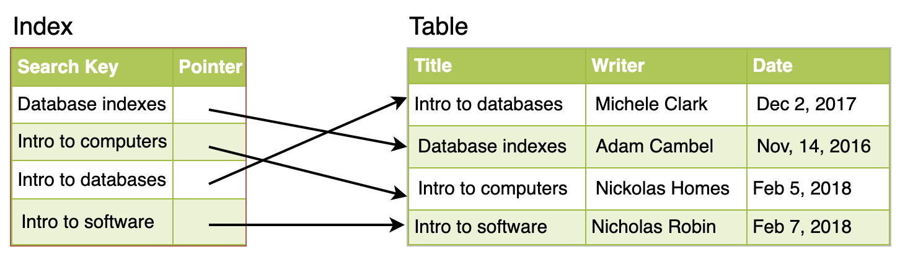

# Indexes

The goal of creating an index on a particular table in a database is to make it faster to search through the table and find the row or rows that we want. Indexes can be created using 1 or more columns of a database table, providing the basis for both rapid random lookups and efficient access of ordered records.

___

## Example: A Library Catalog

The catalog is organized like a database table generally with 4 columns: book title, writer, subject, and date of publication. There are usually 2 such catalogs: 1 sorted by the book title, and 1 sorted by the writer name. These catalogs are like indexes for the database of books.

Simply saying, an index is a data structure that can be perceived as a table of contents that points us to the location where actual data lives. So, when we create an index on a column of a table, we store that column and a pointer to the whole row in the index.

Just like a traditional relational data store, we can also apply this concept to larger datasets. In the case of data sets that are many terabytes in size, but have very small payloads (e.g., 1 KB), indexes are a necessity for optimizing data access.

___

## How Do Indexes Decrease Write Performance?

An index can dramatically speed up data retrieval but may itself be large due to the additional keys, which slow down data insertion and update. When adding rows or making updates to existing rows for a table with an active index, we not only have to write the data, but also have to update the index. This will decrease write performance.
