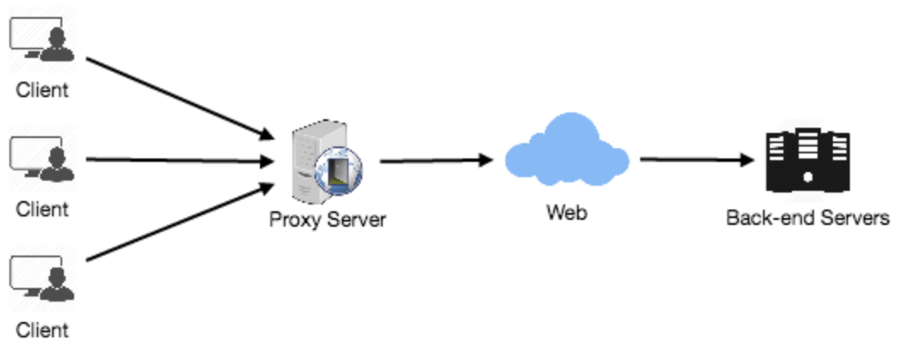

# Proxies

A proxy server is an intermediate server between the client and the
backend server. Typically, proxies are used to filter requests, log
requests, or sometimes transform requests (by adding/removing headers,
encrypting/decrypting, or compressing a resource). Another advantage
of a proxy server is that its cache can serve a lot of requests.

___

## Proxy Server Types

**Open Proxy**

An open proxy is a proxy server that is accessible by any internet user. 2 famous types:
1. **Anonymous Proxy:** Reveals its identity as a server but does not disclose the initial IP address.
2. **Transparent Proxy:** Identifies itself, and with the support of HTTP headers, the first IP address can be viewed.

**Reverse Proxy**

A reverse proxy retrieves resources on behalf of a client from 1 or more servers. The resources are then returned to the client, appearing as if they originated from the proxy server itself.
