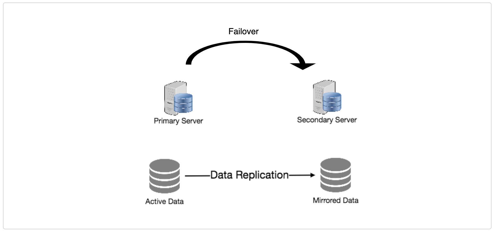

# Redundancy and Replication

Redundancy is the duplication of critical components or functions of a
system with the intention of increasing the reliability of the system,
usually in the form of a backup or fail-safe, or to improve actual
system performance. For example, if there is only one copy of a file
stored on a single server, then losing that server means losing the
file. Redundancy plays a key role in removing the single points of
failure in the system and provides backups if needed in a crisis.

Replication means sharing information to ensure consistency between
redundant resources, such as software or hardware components, to
improve reliability, fault-tolerance, or accessibility. Replication
is widely used in many database management systems (DBMS), usually
with a master-slave relationship between the original and the copies.
