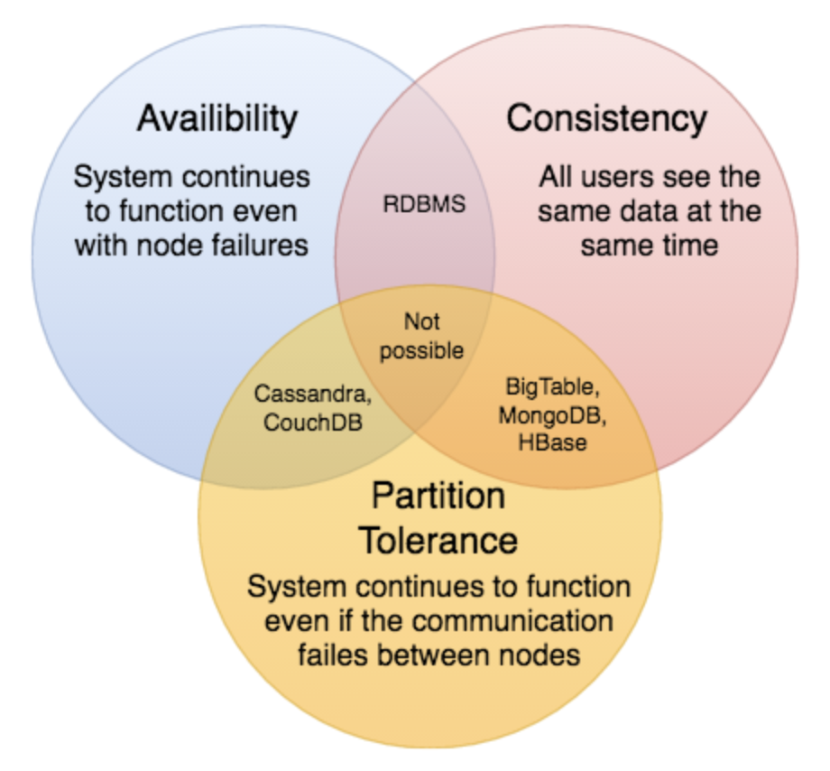

# CAP Theorem

Cap theorem states that it is impossible for a distributed software system to simultaneously provide more than 2 out of 3 of the following guarantees (CAP): Consistency, Availability, and Partition tolerance. When we design a distrivuted system, trading off among CAP is almost the first thing we want to consider.

**Consistency:** All nodes see the same data at the same time. Consistency is achieved by updating several nodes before allowing further reads.

**Availability:** Every request gets a reponse on success/failure. Availability is achieved by replicating the data across different servers.

**Partition Tolerance:** The system continues to work despite message loss or partial failure. A system that is partition-tolerant can sustain any amount of network failure that doesn't result in a failure of the entire network.

We cannot build a general data store that is continually available, sequentially consistent, and tolerant to any partition failures. To be consistent, all nodes should see the same set of updates in the same order. But if the network suffers a partition, updates in 1 partition might not make it to the other partitions before a client reads from the out-of-date partition after having read from the up-to-date one. The only thing that can be done to cope with this possibility is to stop serving requests from the out-of-date partition, but then the service is no longer 100% available.
