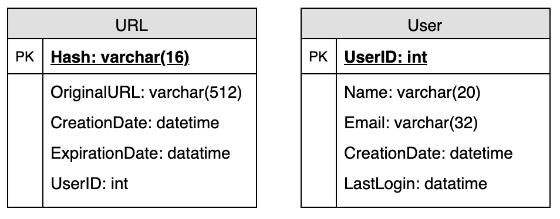
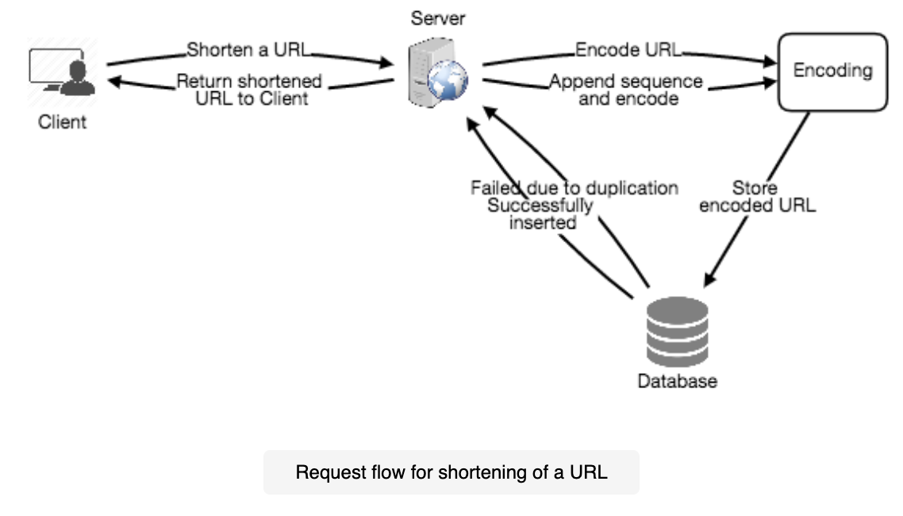
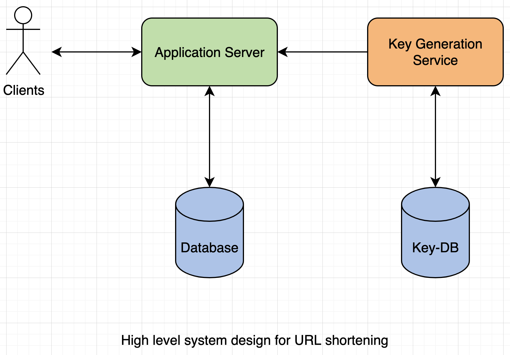
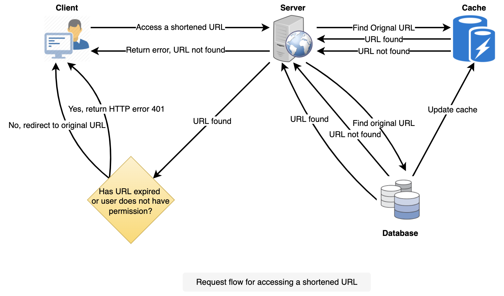
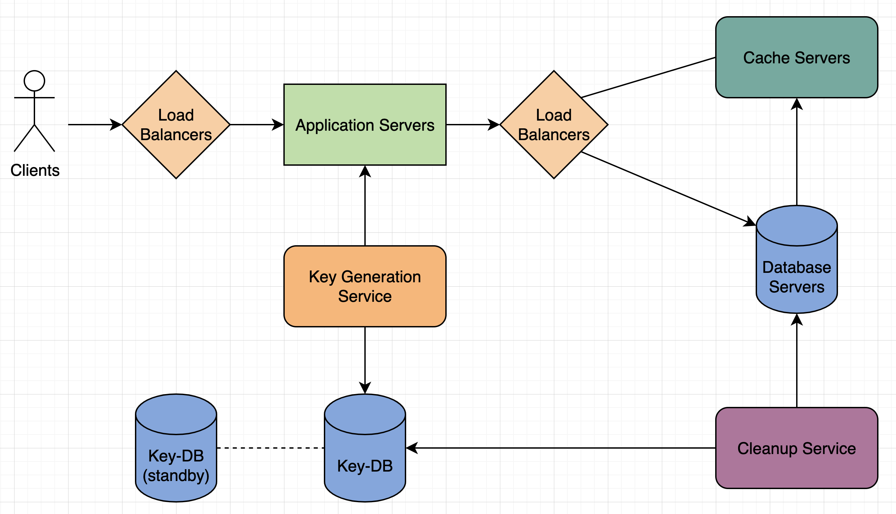

# Designing a URL Shortening Service like TinyURL

Let's design a URL shortening service like TinyURL. This service will provide short aliases redirecting to long URLs.

Similar services: bit.ly, goo.gl, qlink.me, etc.

---

## 1. Why do we need URL shortening?

URL shortening is used to create shorter alises for long URLs. These "short links" save a lot of space when displayed, printed, messaged, or tweeted.

For example, if we shorten this page thorough TinyURL:

[https://www.educative.io/collection/page/5668639101419520/5649050225344512/5668600916475904/](https://www.educative.io/collection/page/5668639101419520/5649050225344512/5668600916475904/)

We would get:

[http://tinyurl.com/jlg8zpc](http://tinyurl.com/jlg8zpc)

URL shortening is used for optimizing links across devices, tracking individual links to analyze audience and campaign performance, and hiding affiliated original URLs.

---

## 2. Requirements and Goals of the System

Clarify requirements at the beginning, find exact scope of the system.

Our URL shortening system should meet the following requirements:

**Functional Requirements:**

1. Given a URL, our service should generate a shorter and unique alias of it.
2. When users access a short link, our service should redirect them to the original link.
3. Users should optionally be able to pick a custom short link for their URL.
4. Links will expire after a standard default timespan, users should be able to specify this expiration time.

**Non-Functional Requirements:**

1. The system should be highly available. This is required because, if our service is down, all the URL redirections will start failing.
2. URL redirection should happen in real-time with minimal latency.
3. Shortened links should not be guessable (not predictable).

**Extended Requirements:**

1. Analytics; e.g., how many times a redirection happened?
2. Our service should also be accessible through REST APIs by other services.

---

## 3. Capacity Estimation and Constraints

Our system will be read-heavy. There will be lots of redirection requests compared to new URL shortenings. Let's assume a 100:1 ratio between read and write.

**Traffic estimates:** Assuming, we will have 500 million new URL shortenings per month, with 100:1 read/write ratio, we can expect 50 billion redirections during the same period:

`100 * 500 million => 50 billion`

What would be Queries Per Second (QPS) for our system? New URL shortenings per second:

`500 million / (30 days * 24 hours * 3,600 seconds) = ~200 URLs/s`

Considering 100:1 read/write ratio, URL redirections per second will be:

`100 * 200 URLs/second = 20,000 redirections/s`

**Storage estimates:** Let's assume we store every URL shortening request (and associated shortened link) for 5 years. Since we expect to have 500 million new URLs every month, the total number of objects we expect to store will be 30 billion:

`500 million * 5 years * 12 months = 30 billion`

Let's assume that each stored object will be approximately 500 bytes (just a ballpark estimate). We will need 15 TB of total storage:

`30 billion * 500 bytes = 15 TB`

**Bandwidth estimates:** For write requests, since we expect 200 new URLs every second, total incoming data for our service will be 100 KB per second:

`200 * 500 bytes = 100 KB/s`

For read requests, since every second we expect ~20,000 URL redirections, total outgoing data for our service would be 10 MB per second:

`20,000 * 500 bytes = ~10 MB/s`

**Memory estimates:** If we want to cache some of the hot URLs that are frequently accessed, how much memory will we need to store them? If we follow the 80-20 rule, meaning 20% of URLs generate 80% of traffic, we would like to cache these 20% hot URLs.

Since we have 20,000 requests per second, we will be getting 1.7 billion requests per day:

`20,000 * 3600 seconds * 24 hours = ~1.7 billion`

To cache 20% of these requests, we will need 170 GB of memory.

`0.2 * 1.7 billion * 500 bytes = ~170 GB`

One thing to note here is that since there will be a lot of duplicate requests (of the same URL), therefore, our actual memory usage will be less than 170 GB.

**High level estimates:** Assuming 500 million new URLs per month and 100:1 read:write ratio, following is the summary of the high level estimates for our service:

| Properties | Estimation |
| ----------- | ----------- |
| New URLs | 200 URLs/s |
| URL redirections | 20,000 redirections/s |
| Incoming data | 100 KB/s |
| Outgoing data | 10 MB/s |
| Storage for 5 years | 15 TB |
| Memory for cache | 170 GB |

---

## 4. System APIs

Define system APIs, explicitly state what is expected from the system.

We can have SOAP or REST APIs to expose the functionality of our service. Following could be the definitions of the APIs for creating and deleting URLs:

`createURL(apiDevKey, originalUrl, customAlias = None, userName = None, expireDate = None)`

**Required Parameters:**
- apiDevKey (string): The API developer key of a registered account. This will be used to, among other things, throttle users based on their allocated quota.
- originalUrl (string): Original URL to be shortened.

**Returns:** (string)
A successful insertion returns the shortened URL; otherwise, it returns an error code.

`deleteURL(apiDevKey, urlKey)`

Where "urlKey" is a string representing the shortened URL to be retrieved. A successful deletions returns 'URL Removed'.

---

## 5. Database Design

Defining the DB schema to understand the data flow among various components and later would guide towards data partitioning.

A few observations about the nature of the data we will store:
1. We need to store billions of records.
2. Each object we store is small (less than 1 K).
3. There are no relationships between records - other than storing which user created a URL.
4. Our service is read-heavy.

**Database Schema:**

We would need 2 tables: 1 for storing info about the URL mappings, and 1 for the user's data who created the short link.

**What kind of database should we use?** Since we anticipate storing billions of rows, and we don't need to use relationships between objects - a NoSQL store like DynamoDB or Cassandra is a better choice. A NoSQL choice would also be easier to scale.

---

## 6. Basic System Design and Algorithm

In the TinyURL example in Section 1, the shortened URL is "[http://tinyurl.com/jlg8zpc](http://tinyurl.com/jlg8zpc)". The last 7 characters of this URL is the short key we want to generate. We'll explore 2 solutions here:

### a. Encoding Actual URL

We can compute a unique hash (e.g., MD5 or SHA256, etc.) of the given URL. The encoding could be Base36 ([a-z, 0-9]) or Base62([A-Z, a-z, 0-9]) and if we add '+' and '/' we can use Base64 encoding. What should be the length of the short key?

Using Base64 encoding, a 6 letter long key would result in `64^6 = ~68.7 billion` possible strings. 8 letter long would result in `64^8 = ~281 trillion` possible strings.

With 68.7 billion unique strings, let's assume 6 letter keys would suffice for our system.

**What are the different issues with our solution?**
1. If multiple users enter the same URL, they can get the same shortened URL, which is not acceptable.
2. What if parts of the URL are URL-encoded? e.g., [http://www.educative.io/distributed.php?id=design](http://www.educative.io/distributed.php?id=design), and [http://www.educative.io/distributed.php%3Fid%3Ddesign](http://www.educative.io/distributed.php%3Fid%3Ddesign) are identical except for the URL encoding.

**Workaround for the issues:** We can append an increasing sequence number to each input URL to make it unique, and then generate a hash of it. Possible problems with this approach could be an ever-increasing sequence number. Can it overflow? Could also impact performance.

Another solution could be to append user ID (which should be unique) to the input URL. However, if the user has not signed in, we would have to ask the user to choose a uniqueness key.

### b. Generating Keys Offline

We can have a standalone **Key Generation Service (KGS)** that generates random 6 letter strings beforehand and stores them in a database (let's call it key-DB). Whenever we want to shorten a URL, we will just take one of the already generated keys and use it. Won't have to worry about duplications or collisions, KGS will make sure all the keys are unique.

**What would be the key-DB size?** With Base64 encoding, we can generate 68.7 billion unique 6 letter keys. If we need one byte to store 1 alphanumeric character, we can store all these keys in:

`6 (characters per key) * 68.7 billion (unique keys) = 412 GB`

**Isn't KGS a single point of failure?** Yes, it is. To solve this, we can have a standby replica of KGS. Whenever the primary server dies, the standby server can take over to generate and provide keys.

**How would we perform a key lookup?** We can look up the key in our database to get the full URL. If it's present in the the DB, issue an "HTTP 302 Redirect" status back to the browser and passing in the stored URL, else issue an "HTTP 404 Not Found" status or redirect back to home.

---

## 7. Data Partitioning and Replication

To scale out our DB, we need to partition it so that it can store info about billions of URLs. We need to come up with a partitioning scheme that would divide and store our data into different DB servers.

**a. Range Based Partitioning:** We can store URLs in separate partitions based on the first letter of the hash key. The main problem with this approach is that it can lead to unbalanced DB servers.

**b. Hash Based Partitioning:** We take a hash of the object we are storing. We then calculate which partition to used based upon the hash. Our hashing function will randomly distribute URLs into different partitions (e.g., our hashing function can always map any 'key' to a number between [1...256]), and this number would represent the partition.

---

## 8. Cache

We can cache URLs that are frequently accessed. The application servers, before hitting backend storage, can quickly check if the cache has the desired URL.

**How much cache memory should we have?** We can start with 20% of daily traffic and, based on clients' usage pattern, we can adjust how many cache servers we need.

**Which cache eviction policy would best fit our needs?** When the cache is full, and we want to replace a link with a newer/hotter URL, Least Recently Used (LRU) can be a reasonable policy for our system. To further increase the efficiency, we can replicate our caching servers to distribute the load between them.

**how can each cache replica be updated?** Whenever there is a cache miss, our servers would be hitting a backend database. Whenever this happens, we can update the cache and pass the new entry to all the cache replicas.

---

## 9. Load Balancer (LB)

We can add a load balancing layer at 3 places in our system:

1. Between clients and application servers
2. Between application servers and database servers
3. Between application servers and cache servers

Initially, we could use a simple Round Robin approach that distributes incoming requests equally among backend servers. Simple, no overhead, if a server is dead it will take it out of the rotation. A problem is that we don't take server load into consideration, if a server is overloaded or slow, the LB will not stop sending new requests to that server. To handle this, can periodically query the backend server about its load and adjusts traffic based on that.

---

## 10. Purging or DB Cleanup

We can slowly remove expired links and do a lazy cleanup. Our service will make sure that only expired links will be deleted.

- Whenever a user tries to access an expired link, we can delete the link and return an error to the user.
- A separate cleaup service can run periodically to remove expired links from our storage and cache.
- We can have a default expiration time for each link (e.g., 2 years).

