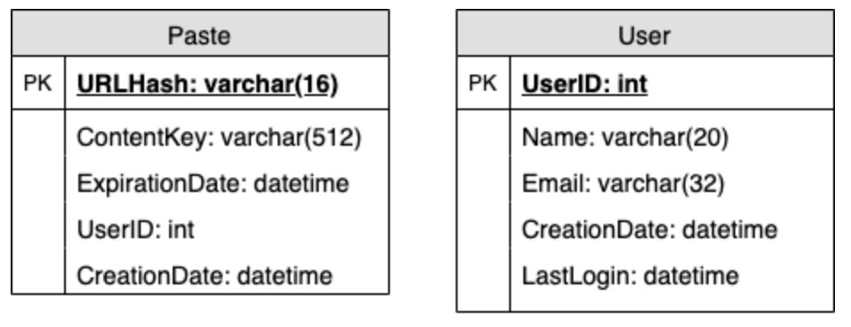
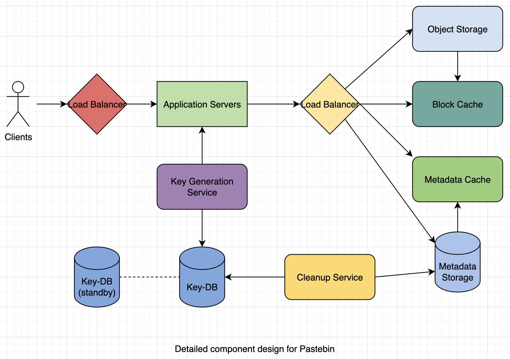

# Designing Pastebin

Let's design a Pastebin-like web service, where users can store plain text. Users of the service will enter a piece of text and get a randomly generated URL to access it.

___

## 1. What is Pastebin?

Pastebin-like services enable users to store plain text or images over the network and generate unique URLs to access the uploaded data.

___

## 2. Requirements and Goals of the System

**Functional Requirements:**
1. Users should be able to upload or "paste" their data and get a unique URL to access it.
2. Users will only be able to upload text.
3. Data and links will expire after a specific timespan automatically; users should also be able to specify expiration time.
4. Users should optionally be able to pick a custom alias for their paste.

**Non-Functional Requirements:**
1. The system should be highly reliable, any data uploaded should not be lost.
2. The system should be highly available. This is required because if our service is down, users will not be able to access their pastes.
3. Users should be able to access their pastes in real time with minimum latency.
4. Paste links should not be guessable (not predictable).

___

## 3. Some Design Considerations

Pastebin shares some requirements with URL shortening service, but there are some additional design considerations we should keep in mind.

**What should be the limit on the amount of text users can paste at a time?** We can limit users not to have pastes bigger than 10 MB to stop the abuse of the service.

**Should we impose limits on custom URLs?** Yes, so that we have a consistent URL database.

___

## 4. Capacity Estimation and Constraints

Our services will be read-heavy; there will be more read requests compared to new paste creation. We can assume a 5:1 ratio between read and write.

**Traffic estimates:** Pastebin services are not expected to have traffic similar to Twitter or Facebook, let's assume here that we get 1 million new pastes added to our system every day. This leaves us with 5 million reads per day.

**Storage estimates:** Users can upload maximum of 10 MB of data; such texts are not huge, so let's assume that each paste on average contains 10 KB.

**Bandwidth estimates:** For write requests, expect about 12 new pastes per second. As for read requests, expect about 58 requests per second.

**Memory estimates:** We can cache some of the hot pastes that are frequently accessed. Following the 80-20 rule, meaning 20% of hot pastes generate 80% of traffic, we would like to cache these 20% pastes.

___

## 5. System APIs

We can have SOAP or REST APIs to expose the functionality of our service. Following could be the definitions of the APIs to create/retrieve/delete pastes:

`addPaste(apiDevKey, pasteData, customUrl = None, userName = None, pasteName = None, expireDate = None`

**Required Parameters:**
- apiDevKey (string): The API developer key of a registered account. This will be used to, among other things, throttle users based on their allocated quota.
- pasteData (string): Textual data of the paste.

**Returns:** (string)
A successful insertion returns the URL through which the paste can be accessed, otherwise, it will return an error code.

Similarly, we can have retrieve and delete paste APIs:

`getPaste(apiDevKey, apiPasteKey)`

Where 'apiPasteKey' is a string representing the paste key of the paste to be retrieved. This API will return the textual data of the paste.

`deletePaste(apiDevKey, apiPasteKey)`

A successful deletion returns 'true', otherwise returns 'false'.

___

## 6. Database Design

A few observations about the nature of the data we are storing:

1. We need to store billions of records.
2. Each metadata object we are storing would be small.
3. Each paste object we are storing can be of medium size.
4. There are no relationships between records, except if we want to store which user created what paste.
5. Our service is read-heavy.

**Database Schema:**

We would need 2 tables, 1 for storing info about the pastes and the other for users' data.

Here, `URLHash` is the URL equivalent of the TinyURL and 'ContentKey' is a reference to an external object storing the contents of the paste.

___

## 7. High Level Design

At a high level, we need an application layer that will serve all the read and write requests. Application layer will talk to a storage layer to store and retrieve data. We can segregate our storage layer with one database storing metadata related to each paste, users, etc., while the other storing the paste contents in some object storage (like Amazon S3). This division of data will also allow us to scale them individually.

___

## 8. Component Design

### **a. Application Layer**

Our application layer will process all incoming and outgoing requests. The application servers will be talking to the backend data store components to serve the requests.

**How to handle a write request?** Upon receiving a write request, our application server will generate a 6 letter random string, which would serve as the key of the paste. The application server will then store the contents of the paste and the generated key in the database. One possible problem here could be that the insertion fails because of a duplicate key. In that case, we should regenerate a new key and try again.

Another solution could be to run a standalone **Key Generation Service** (KGS) that generates random 6 letter strings beforehand and stores them in a database (let's call it key-DB). Whenever we want to store a new paste, we will just take one of the already generated keys and use it. KGS can use 2 tables to store keys, 1 for keys that are not used yet, and 1 for all the used keys.

**Isn't KGS a single point of failure?** Yes, it is. To solve this, we can have a standby replica of KGS, and whenever the primary server dies, it can take over to generate and provide keys.

**How does it handle a paste read request?** Upon receiving a read paste request, the application service layer contacts the datastore. The datastore searches for the key, and if it is found, returns the paste's contents. Otherwise, an error code is returned.

### **b. Datastore Layer**

We can divide our datastore layer into 2:
1. Metadata Database: We can use a relational database like MySQL or a Distributed Key-Value store like Dynamo or Cassandra.
2. Object Storage: We can store our contents in an Object Storage like Amazon S3. Whenever we feel like hitting our full capacity on content storage, we can easily increase it by adding more servers.

