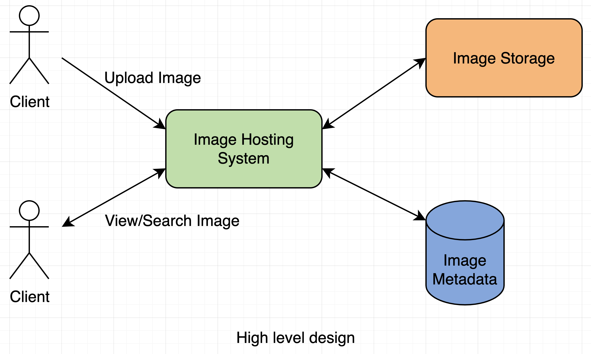
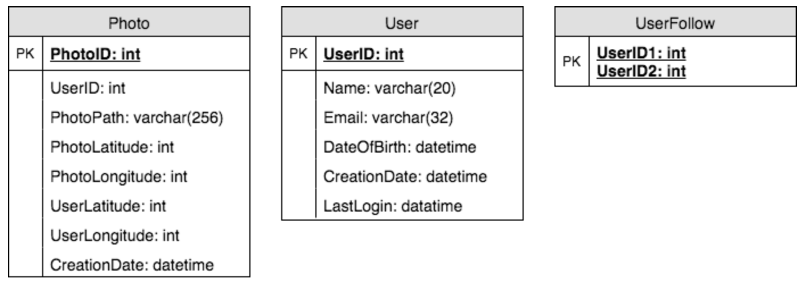
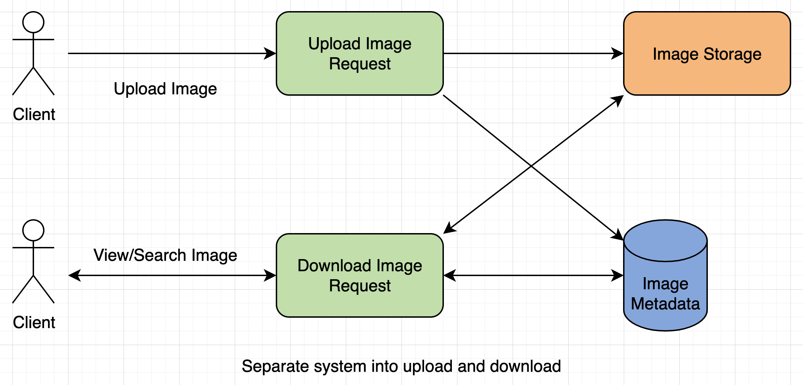
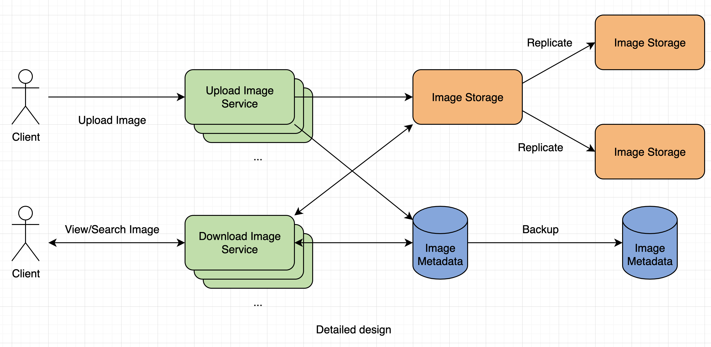

# Designing Instagram

Let's design a photo sharing service like Instagram, where users can upload photos to share them with other users.

___

## 1. What is Instagram?

For the sake of this exercise, we plan to design a simpler version of Instagram, where a user can share photos and can also follow other users. The 'News Feed' for each user will consist of top photos of all the people the user follows.

___

## 2. Requirements and Goals of the System

**Functional Requirements**
1. Users should be able to upload/download/view photos.
2. Users can perform searches based on photo/video titles.
3. Users can follow other users.
4. The system should be able to generate and display a user's News Feed consisting of top photos from all the people the user follows.

**Non-Functional Requirements**
1. Our service needs to be highly available.
2. The acceptable latency of the system is 200 ms for News Feed generation.
3. Consistency can take a hit (in the interest of availability), if a user doesn't see a photo for a while; it should be fine.
4. The system should be highly reliable; any uploaded photo or video should never be lost.

___

## 3. Some Design Considerations

The system would be read-heavy, so we will focus on building a system that can retrieve photos quickly.

1. Practically, users can upload as many photos as they like. Efficient management of storage should be a crucial factor while designing this system.
2. Low latency is expected while viewing photos.
3. Data should be 100% reliable. If a user uploads a photo the system will guarantee that it will never be lost.

___

## 4. Capacity Estimation and Constraints

- Let's assume we have 500 million total users, with 1 million daily active users.
- 2 million new photos every day, 23 new photos every second.
- Average photo file size >= 200 KB.
- Total space required for 1 day of photos:
    `2 million * 200 KB => 400 GB`
- Total space required for 10 years:
    `400 GB * 365 (days a year) * 10 (years) ~= 1,425 TB`

___

## 5. High Level System Design

At a high level, we need to support 2 scenarios, 1 to upload photos, and the other to view/search photos. Our service would need some object storage servers to store photos and also some database servers to store metadata info about the photos.

___

## 6. Database Schema

We need to store data about users, their uploaded photos, and people they follow. Photo table will store all data related to a photo; we need to have an index on (PhotoID, CreationDate) since we need to fetch recent photos first.

A straightforward approach for storing the above schema would be to use an RDBMS like MySQL since we require joins. But relational databases come with their challenges, especially when we need to scale them.

We can store photos in a distributed file storage like Hadoop or S3.

We can store the above schema in a distributed key-value store to enjoy the benefits offered by NoSQL. We need to store relationships between users and photos, to know who owns which photo. We also need to store the list of people a user follows. For both of these tables, we can use a wide-column datastore like Cassandra. Cassandra or key-value stores in general, always maintain a certain number of replicas to offer reliability.

___

## 7. Component Design

Photo uploads (or writes) can be slow as they have to go to the disk, whereas reads will be faster, especially if they are being served from cache.

Uploading users can consume all the available connections, as uploading is a slow process. This means that 'reads' cannot be served if the system gets busy with all the write requests. To handle this bottleneck we can split reads and writes into separate services. This will also allow us to scale and optimize each of these operations independently.

___

## 8. Reliability and Redundancy

Losing files is not an option for our service. Therefore, we will store multiple copies of each file so that if 1 storage server dies, we can retrieve the photo from the other copy present on a different storage server. If we want to have high availability of the system, we need to have multiple replicas of services running in the system, so that if a few services die down, the system still remains available and running. Creating redundancy in a system can remove single points of failure and provide a backup or spare functionality if needed in a crisis.

___

## 9. Data Sharding

### **a. Partitioning based on UserID:**
Shard based on the 'UserID' so that we can keep all photos of a user on the same shard. Each DB shard can have its own auto-increment sequence for PhotoIDs and since we will append ShardID with each PhotoID, it will make it unique throughout our system.

**Issues:**
1. How would we handle hot users?
2. Some users will have a lot of photos compared to others, thus making a non-uniform distribution of storage.
3. What if we cannot store all pictures of a user on one shard?

### **b. Partitioning based on PhotoID:**
If we can generate unique PhotoIDs first and then find a shard number through "PhotoID % 10", the above problems will have been solved. We could dedicate a separate database instance to generate auto-incrementing IDs, so whenever we would like to add a photo in our system, we can insert a new row in this table and take that ID to be our PhotoID of the new photo.

**Wouldn't this key generated DB be a single point of failure?**
Yes, it would be. A workaround for that could be defining 2 such databases with 1 generating even numbered IDs and the other odd numbered. We can put a load balancer in front of both of these databases to round robin between them and to deal with downtime.

**Alternately**, we can implement a 'key' generation scheme similar to TinyURL.

___

## 10. Ranking and News Feed Generation

To create the News Feed for any given user, we need to fetch the latest, most popular and relevant photos of the people the user follows.

For simplicity, let's assume we need to fetch top 100 photos for a user's News Feed. We could use a ranking algorithm which determines these photos based on recency, likeness, etc. A possible problem with this approach would be higher latency for querying, sorting, merging, ranking, etc. To improve efficiency, we can pre-generate the News Feed and store it in a separate table.

**What are the different approaches for sending New Feed contents to the users?**

**1. Pull:** Clients can pull the News Feed contents from the server on a regular basis or manually. Possible problems: a) new data might not be shown until clients issue a pull, b) most of the time will result in empty if there is no new data.

**2. Push:** Servers can push new data to users as soon as it is available. A possible problem with this approach is, a user who follows a lot of people, the server has to push updates quite frequently.

**3. Hybrid:** We can move all the users who have a high number of follows to a pull-based model, and only push data to those users who have a few hundred (or thousand) follows.

___

## 11. News Feed Creation with Sharded Data

We need to have a mechanism to sort photos on their time of creation. To efficiently do this, we can make photo creation time part of the PhotoID. As we will have a primary index on PhotoID, it will be quite quick to find the latest PhotoIDs.

___

## 12. Cache and Load Balancing

Our service would need a massive scale photo delivery system to serve the globally distributed users. Our service should push its content closer to the user using a large number of geographically distributed photo cache servers and use CDNs. We can use Memcached to cache the data. Least Recently Used (LRU) can be a reasonable cache eviction policy for our system.
