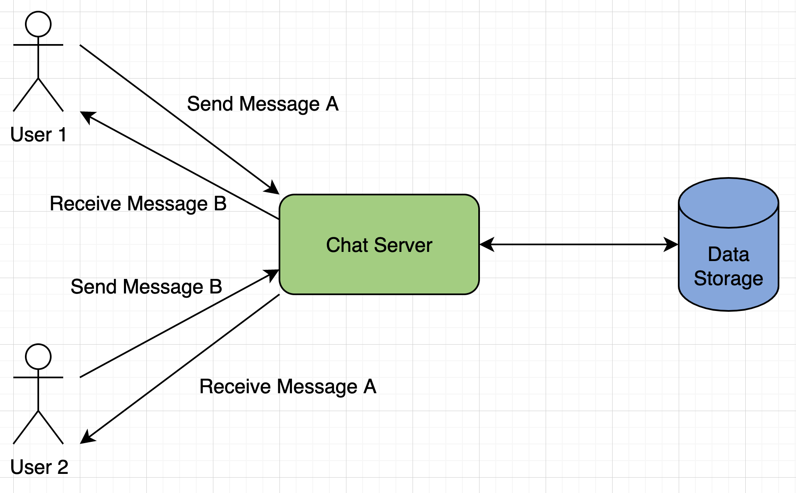
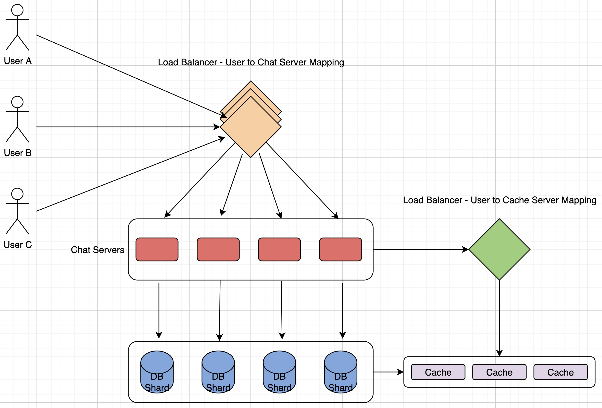

# Designing Facebook Messenger

Let's design an instant messaging service like Facebook Messenger where users can send text messages to each other through web and mobile interfaces.

---

## 1. What is Facebook Messenger?

Text-based instant messaging services, chat with Facebook friends both from cell phones and Facebook's website.

---

## 2. Requirements and Goals of the System

**Functional Requirements:**
1. Support 1-on-1 conversations between users.
2. Keep track of the online/offline statuses of its users.
3. Support the persistent storage of chat history.

**Non-Functional Requirements:**
1. Real-time chat experience with minimum latency.
2. Highly consistent, should be able to see the same chat history on all devices.
3. High availability is desirable, we can tolerate lower availability in the interest of consistency.

---

## 3. Capacity Estimation and Constraints

Assume 500 million daily active users and on average each user sends 40 messages daily, this gives us 20 billion messages per day.

**Storage:** Store chat messages, users' info, messages' metadata (ID, timestamp, etc.), data compression and replication.

**Bandwidth:** Since each incoming message needs to go out to another user, need same amount of bandwidth for both upload and download.

---

## 4. High Level Design

At a high level, need a chat server that will be the central piece, orchestrating all the communication between users. When user wants to send a message to another, connect to this chat server and send message to server, server then passes that message to the other user and stores it in the database.

Workflow:
1. User 1 sends message to User 2 through chat server.
2. Server receives message and sends an acknowledgement to User 1.
3. Server stores message in database and sends the message to User 2.
4. User 2 receives message and sends the acknowledgement to server.
5. Server notifies User 1 that message has been delivered successfully.

---

## 5. Detailed Component Design

Build simple solution first where everything runs on 1 server. At a high level our system needs to handle the following use cases:
1. Receive incoming messages and deliver outgoing messages.
2. Store and retrieve messages from the database.
3. Keep a record of which user is online or has gone offline, and notify all relevant users about these status changes.

### a. **Message Handling**

**How would we efficiently send/receive messages?** 

To get a message from the server, 2 options:
1. **Pull Model:** Users can periodically ask server if there are any new messages for them.
2. **Push Model:** Users can keep a connection open with server and can depend upon server to notify them whenever there are new messages.

In 1st approach, server needs to keep track of messages still waiting to be delivered, and as soon as receiving user connects to server to ask for any new message, the server can return all the pending messages. To minimize latency, have to check server frequently, and most of the time they will be getting empty response if no pending. Not a good solution.

In 2nd approach, since connection kept open with server, as soon as server receives a message, can immediately pass it to intended user. This way, server doesn't need to keep track of pending messages, and we will have minimum latency, as messages are delivered instantly on the opened connection.

**How will clients maintain an open connection with the server?**

Can use HTTP long polling or WebSockets. In long polling, clients can request info from server with expectation that server may not respond immediately. If no new data, instead of empty response, server holds request open and waits for response info to become available. Once it has new info, server immediately sends response to client, and upon receiving, can immediately issue another request. This gives a lot of improvements in latencies, throughputs, and performance.

**How can server keep track of all opened connections efficiently?**

Server can maintain a hash table, where "key" would be the UserID, and "value" would be the connection object. So, whenever server receives message for a user, it looks up that user in hash table to find connection object and sends message on the open request.

**How do we know which server holds the connection to which user?**

Introduce a software load balancer in front of chat servers, that can map each UserID to a server to redirect the request.

**How should server process a 'deliver message' request?**

Server needs to do the following things upon receiving a new message:
1. Store message in database.
2. Send message to receiver.
3. Send acknowledgement to sender.

**How does messenger maintain sequencing of messages?**

Can store a timestamp with each message, which is time the message is received by the server. This still won't ensure correct ordering, e.g., U1 sends M1 at T1, U2 sends M2 at T2 where T1 < T2, server sends M1 to U2 and M2 to U1, U1 will see M1 then M2, U2 will see M2 then M1.

To resolve this, keep a sequence number with every message for each client. This will determine exact ordering of messages for EACH user.

### b. **Storing and Retrieving Messages From Database**

Whenever chat server receives new message, needs to store it in database. 2 options:
1. Start a separate thread, which will work with database to store message.
2. Send an async request to database to store message.

We have to keep certain things in mind while designing database:
1. How to efficiently work with database connection pool.
2. How to retry failed requests.
3. Where to log those requests that failed even after some retries.
4. How to retry these logged requests (that failed after retry) when all issues have resolved.

**Which storage system should we use?**

Need database that can support very high rate of small updates and also fetch a range of records quickly.

Can't use RDBMS like MySQL or NoSQL like MongoDB because can't afford to read/write a row from the database every time a user receives/sends a message. High latency, huge load on databases.

Both requirements can be easily met with a wide-column database solution like HBase. HBase is a column-oriented key-value NoSQL database that can store multiple values against 1 key into multiple columns. Modeled after Google's BigTable and runs on top of Hadoop Distributed File System (HDFS).

**How should clients efficiently fetch data from server?**

Clients should paginate while fetching data from server. Page size could be different for different clients, e.g., cell phones have smaller screens, so need a fewer number of message/conversations in the viewport.

### c. **Managing User's Status**

Need to keep track of user's online/offline status and notify all relevant users whenever a status change happens. With 500 million active users at any time, if have to broadcast each status change to all relevant active users, will consume a lot of resources. Can do the following optimization:
1. Whenever client starts app, pull current status of all users in friends' list.
2. Whenever user sends message to another that has gone offline, send failure to sender and update status on client.
3. Whenever user comes online, server can always broadcast that status with a delay of a few seconds to see if user doesn't go offline immediately.
4. Clients can pull stattus from server about those users that are being shown on the user's viewport.
5. Whenever client starts new chat with another user, pull status at that time.

**Design Summary:**

- Clients open connection to chat server to send message, server then passes it to requested user.
- All active users keep conntection open with server to receive messages.
- When new message arrives, chat server pushes it to receiving user on long poll request.
- Messages can be stored in HBase, which supports quick small updates, and range-based searches.
- Servers can broadcast online status of a user to other relevant users.
- Clients can pull status updates for users who are visible in their viewport on a less frequent basis.

---

## 6. Data Partitioning

2 options:

**Partitioning based on UserID:**

Partition based on hash of UserID to keep all messages of a user on same database. Data sharding, for simplicity assume we keep 1,000 shards, find shard number by `hash(userID) % 1000`, and then store/retrieve data from there. Very quick to fetch chat history for any user.

**Partitioning based on MessageID:**

If store different messages of a user on separate database shards, fetching a range of messages of a chat would be very slow, so shouldn't adopt this scheme.

---

## 7. Cache

Cache a few recent messages (say last 15) in a few recent convos visible in user's viewport (say last 5).

---

## 8. Load Balancing

Need load balancer in front of chat servers, that map each UserID to a server that holds the connection for the user and then direct the request to that server. Similarly, need load balancer for cache servers.
