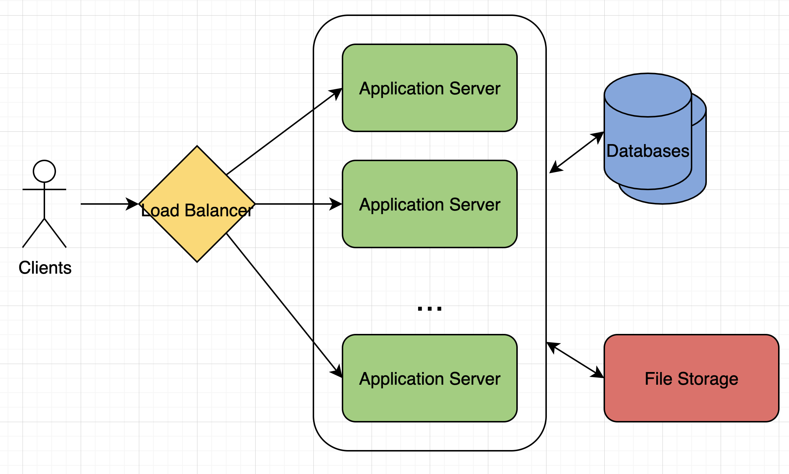
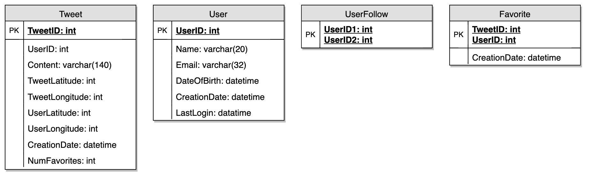
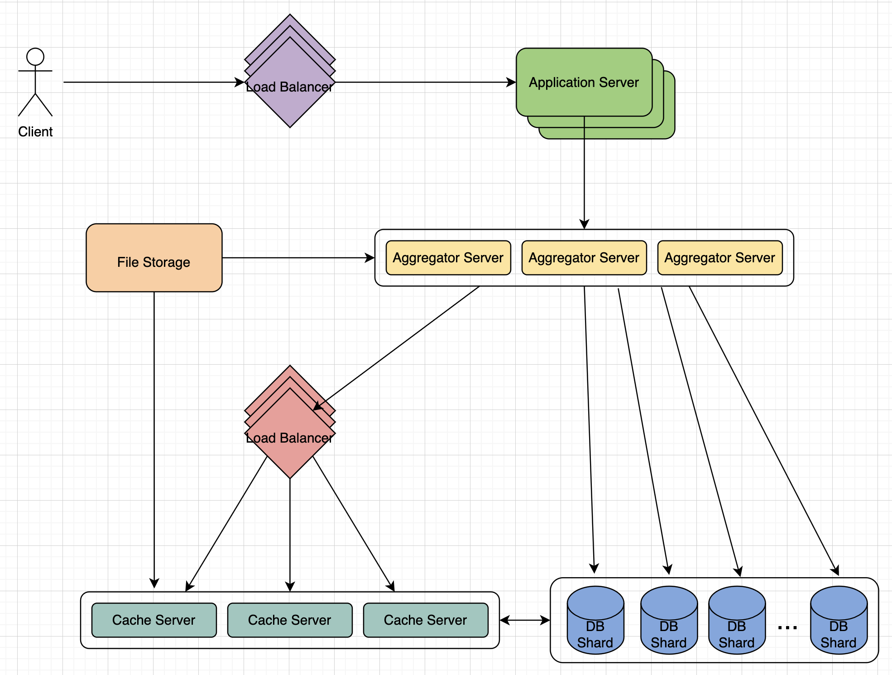

# Designing Twitter

Post tweets, follow other people, and favorite tweets.

---

## 1. What is Twitter?

Social networking service where users post and read tweets. Registered users can post and read tweets, but those who aren't registered can only read. Users access Twitter through website interface, SMS, or mobile app.

---

## 2. Requirements and Goals of the System

**Functional Requirements**
1. Post new tweets.
2. Follow other users.
3. Mark tweets as favorites.
4. Service should be able to create and display a user's timeline consisting of top tweets from all people they follow.
5. Tweets can contain photos and videos.

**Non-Functional Requirements**
1. Service needs to be highly available.
2. Acceptable latency of system is 200 ms for timeline generation.
3. Consistency can take a hit (in the interest of availability), if a user doesn't see a tweet for a while, it should be fine.

---

## 3. Capacity Estimation and Constraints

Assume 1 billion total users with 200 million daily active users. Assume 100 million new tweets every day and on average each user follows 200 people. Assume 1 billion favorites per day and 28 billion total tweet views per day.

**Storage:** 140 character tweets, metadata with each tweet (like ID, timestamp, user ID, etc.), users' data/follows/favorites, photos/videos.

**Bandwidth:** Large amount of total ingress and egress per day, also consider photos/videos.

---

## 4. System APIs

SOAP or REST APIs. Following could be definition of the API for posting a new tweet:

`tweet(apiDevKey, tweetData, tweetLocation = None, userLocation = None, mediaIds = [None])`

**Required Parameters:**
- apiDevKey (string): API developer key of account used to, among other things, throttle based on allocated quota.
- tweetData (string): Text of tweet, typically up to 140 characters.

**Returns:** (string)
Successful post returns URL to access that tweet, otherwise appropriate HTTP error.

---

## 5. High Level System Design

Need system that can efficiently store all new tweets, it is clear from the requirements that this will be a read-heavy system.

At a high level, need multiple application servers to serve all these requests with load balancers in front for traffic distribution. On the backend, need efficient database that can store all new tweets and support huge number of reads. Also need some file storage to store photos and videos.

Expected daily write load is 100 million and read load is 28 billion tweets. Traffix will be distributed unevenly throughout the day, at peak time we should expect way more traffic. Keep this in mind.

---

## 6. Database Schema

Need to store data about users, their tweets, their favorite tweets, and people they follow.

For choosing between SQL and NoSQL databases, refer to Designing Instagram.

---

## 7. Data Sharding

Since huge number of new tweets every day and read load extremely high, need to distribute data onto multiple machines such that can read/write efficiently. Have many options:

**Sharding based on UserID:**

Store all data of a user on one server. While storing, can pass UserID to hash function that will map user to a database server where we store all of their tweets, favorites, follows, etc. 2 problems:
1. What if user becomes hot? A lot of queries, high load will affect performance.
2. Over time some users can end up storing a lot of tweets/follows, maintaining a uniform distribution of growing user data is difficult.

To recover from these situations, either have to re-partition/re-distribute data or use consistent hashing.

**Sharding based on TweetID:**

Hash function will map each TweetID to random server where we store that tweet. To search for tweets, have to query all servers, and each server will return a set of tweets. A centralized server will aggregate these results to return them to user. Looking at timeline generation example, here are the steps to generate a user's timeline:
1. Application server finds all people user follows.
2. App server sends query to all database servers to find tweets from these people.
3. Each database server finds tweets for each user, sort them by recency and return top tweets.
4. App server merges all results and sort them again to return top results to user.

This approach solves problem of hot users, but, in contrast to sharding by UserID, have to query all database partitions to find tweets of a user, which can result in higher latencies.

Further improve performance by introducting cache to store hot tweets in front of database servers.

**Sharding based on tweet creation time:**

Storing tweets based on creation time gives advantage of fetching all top tweets quickly and only have to query a very small set of servers. Problem is traffic load will not be distributed, e.g., while writing, all new tweets go to 1 server and remaining servers sit idle. Also server with latest data will have very high load.

**What if we can combine sharding by TweetID and tweet creation time?**

If don't store tweet creation time separately and use TweetID to reflect that, can get benefits of both approaches. Make each TweetID universally unique in our system and each TweetID should contain a timestamp too.

Can use epoch time for this. TweetID will have 2 parts:
1. Epoch seconds.
2. Auto-incrementing sequence.
With this, can figure out shard number from this TweetID and store it there.

In above approach, still have to query all servers for timeline generation, but reads (and writes) will be substantially quicker.
1. Since don't have any secondary index (on creation time), this reduces write latency.
2. While reading, don't need to filter on creation time, as primary key has epoch time included in it.

---

## 8. Cache

Introduce cache for database servers to cache hot tweets and users. Use solution like Memcached that can store whole tweet objects. Application servers, before hitting database, can quickly check if cache has desired tweets.

**Which cache replacement policy would best fit our needs?** Least Recently Used (LRU) cache, replace least recently viewed tweets first.

**How can we have a more intelligent cache?** 80-20 rule, 20% of tweets generate 80% of read traffic, so try to cache 20% of daily read volume from each shard.

**What if we cache latest data?** Can benefit from this approach. Cache would be like a hash table where 'key' would be 'OwnerID' and 'value' would be a doubly linked list containing all the tweets from that user in the past 3 days.

---

## 9. Timeline Generation

Refer to Designing Facebook's Newsfeed

---

## 10. Replication and Fault Tolerance

Since read-heavy, can have multiple secondary database servers for each DB partition. All writes first go to primary server and then replicated to seconary servers. Also gives fault tolerance, since whenever primary server goes down, can failover to secondary server.

---

## 11. Load Balancing

Can add load balancing at 3 places:
1. Between clients and application servers.
2. Between application servers and database replication servers.
3. Between aggregation servers and cache servers.

Initially, a simple Round Robin approach can be adopted, distributes incoming requests equally among servers. Problem is that it won't take server load into consideration. To handle this, periodically query backend server about load and adjust traffic based on that.
