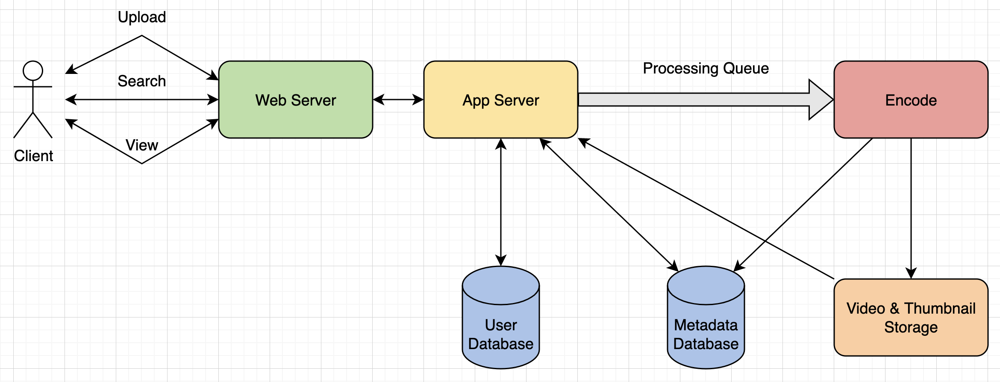
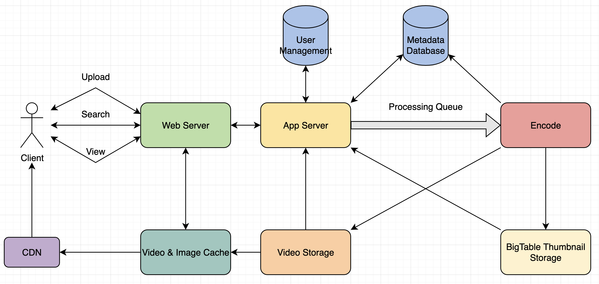

# Designing YouTube or Netflix

Video sharing service like YouTube, where users are able to upload/view/search videos.

---

## 1. Why YouTube?

One of the most populat video sharing websites in the world. Upload, view, share, rate, and report videos, as well as add comments on videos.

---

## 2. Requirements and Goals of the System

**Functional Requirements:**
1. Upload videos.
2. Share and view videos.
3. Perform searches based on video titles.
4. Record stats of videos, e.g., likes/dislikes, total number of views, etc.
5. Add and view comments on videos.

**Non-Functional Requirements:**
1. Highly reliable, any video uploaded should not be lost.
2. Highly available. Consistency can take a hit (in the interest of availability), if a user doesn't see a video for a while, it should be fine.
3. Real-time experience while watching videos and shouldn't feel any lag.

---

## 3. Capacity Estimation and Constraints

Assume 1.5 billion total users, 800 million daily active users. Assume a user views 5 videos per day. Assume `upload:view` ratio is `1:200`, i.e., for every video upload we have 200 videos viewed.

**Storage**: Videos, replication.

**Bandwidth:** `Upload:view` ratio of `1:200`.

---

## 4. System APIs

SOAP or REST APIs. Definition of APIs for uploading and searching videos:

`uploadVideo(apiDevKey, videoTitle, videoDescription = None, tags = [], categoryID, defaultLanguage, recordingDetails, videoContents)`

**Required Parameters:**
- apiDevKey (string): API developer key of account, can be used, among other things, to throttle users based on allocated quota.
- videoTitle (string): Title of video.
- categoryID (string): Category, e.g., Film, Song, People, etc.
- defaultLanguage (string): For example, English, Mandarin, Hindi, etc.
- recordingDetails (string): Location where video was recorded.
- videoContents (stream): Video to be uploaded.

**Returns:** (string)
Successful upload will return HTTP 202 (request accepted) and once video encoding is completed, user is notified through email with link to access video. Can also expose a queryable API to let users know current status of uploaded video.

`searchVideo(apiDevKey, searchQuery, userLocation = None, maximumVideosToReturn, pageToken)`

**Required Parameters:**
- apiDevKey (string): API developer key of account.
- searchQuery (string): String containing search terms.
- maximumVideosToReturn (number): Max number of results returned in 1 request.
- pageToken (string): Specifies a page in the result set that should be returned.

**Returns:** (JSON)
JSON containing info about list of video resources matching search query. Each video resource will have video title, thumbnail, video creation date, and a view count.

`streamVideo(apiDevKey, videoID, offset, codec, resolution)`

**Required Parameters:**
- apiDevKey (string): API developer key of account.
- videoID (string): String to identify video.
- offset (number): Should be able to stream video from any offset, time in seconds from beginning of video.
- codec (string) & resolution (string): Should send codec and resolution info to API from client to support play/pause from multiple devices.

**Returns:** (STREAM)
Media stream (video chunk) from given offset.

---

## 5. High Level Design

At a high level, need the following components:
1. **Processing Queue:** Each uploaded video pushed to a processing queue to be dequeued later for encoding, thumbnail generation, and storage.
2. **Encoder:** Encode each uploaded video into multiple formats.
3. **Thumbnail Generator:** Generate a few thumbnails for each video.
4. **Video and Thumbnail Storage:** Store video and thumbnail files in some distributed file storage.
5. **User Database:** Store user's info, e.g., name, email, address, etc.
6. **Video Metadata Storage:** Metadata database to store all info about videos like title, file path in system, uploading user/total views/likes/dislikes/etc. Also be used to store all video comments.

---

## 6. Database Schema

**Video Metadata Storage - MySQL**
Following info should be stored with each video:
- VideoID/title/description
- Size
- Thumbnail
- Uploader/user
- Total number of likes/dislikes/views

For each video comment, need to store:
- CommentID, VideoID, UserID
- Comment
- TimeOfCreation

**User Data Storage - MySQL**
- UserID, name, email, address, age, registration details, etc.

---

## 7. Detailed Component Design

Service is read-heavy, so focus on building a system that can retrieve videos quickly.

**Where would videos be stored?** Distributed file storage system like Hadoop Distributed File System (HDFS) or GlusterFS.

**How should we manage read traffic?** Segregate read traffic from write traffic. Since will have multiple copies of each video, can distribute read traffix on different servers.

**Where would thumbnails be stored?** Two considerations before deciding which storage system to use:
1. Thumbnails are small files.
2. Read traffic for thumbnails will be huge compared to videos. Users will be watching 1 video at a time, but might be looking at a page with 20 thumbnails of other videos.

Evaluate storing all thumbnails on a disk. Given huge number of files, have to perform a lot of seeks to different locations, this is quite inefficient and will result in higher latencies.

Bigtable can be a good choice, as it combines multiple files into 1 block to store on disk, and is very efficient in reading a small amount of data. Keeping hot thumbnails in cache will also help in improving latencies and, given thumbnails are small, can easily cache a lot.

**Video Uploads:** Since videos could be huge, if while uploading, connection drops, should support resuming from the same point.

**Video Encoding:** Newly uploaded videos are stored on server and new task is added to processing queue to encode video into multiple formats. Once encoding done, uploader notified and video is made available.

---

## 8. Metadata Sharding

Since huge number of new videos every day and read load extremely high, need to distribute data onto multiple machines.

**Sharding based on UserID:** Storing all data for particular user on 1 server. To search videos by titles, have to query all servers and each server returns a set of videos. Centralized server then aggregates and ranks these results before returning.

Couple of issues:
1. What is user becomes popular? There could be a lot of queries for this user, creates perfomance bottleneck and affect overall performance.
2. Over time, some users can end up storing a lot of videos, maintaining uniform distribution would become tricky.

To recover, either have to re-partition/re-distribute our data, or use consistent hashing to balance load between servers.

**Sharding based on VideoID:** Hash function will map each VideoID to a random server where we store that video's metadata. To find videos of a user, query all servers and each server returns set of videos. Centralized server aggregates and ranks these results before returning. 

This approach solves problem of popular users, but shifts it to popular videos. Can further improve performance by introducing a cache to store hot videos in front of database servers.

---

## 9. Load Balancing

Use consistent hashing among cache servers, which will help in balancing load between cache servers. Since we will use static hash-based scheme to map videos to hostnames, it can lead to an uneven load on the logical replicas due to different popularity of each video. To resolve this issue, any busy server in 1 location can redirect a client to a less busy server in the same cache location. Can use dynamic HTTP redirections.

Drawbacks. First, since service tries to load balance locally, can lead to multiple redirections if host that receives redirection can't serve the video. Also each redirection requires a client to make an additional HTTP request, leading to higher delays before video starts playing back.

---

## 10. Cache

Introduce cache for metadata servers to cache hot database rows. Use Memcached to cache data, application servers can then check if cache has desired rows before hitting database. Can use Least Recently Used (LRU) cache eviction policy.

**How can we build more intelligent cache?** 80-20 rule, i.e., 20% of daily read volume for videos is generating 80% of traffic, try caching 20% of daily read volume of videos and metadata.

---

## 11. Content Delivery Network (CDN)

CDN is a system of distributed servers that deliver web content based on geographic locations of user. Our service can move popular videos to CDNs:
- CDNs replicate content in multiple places. There's a better chance of videos being closer to the user and, with fewer hops, videos will stream from a friendlier network.
- CDN machines make heavy use of caching and can mostly serve videos out of memory.
