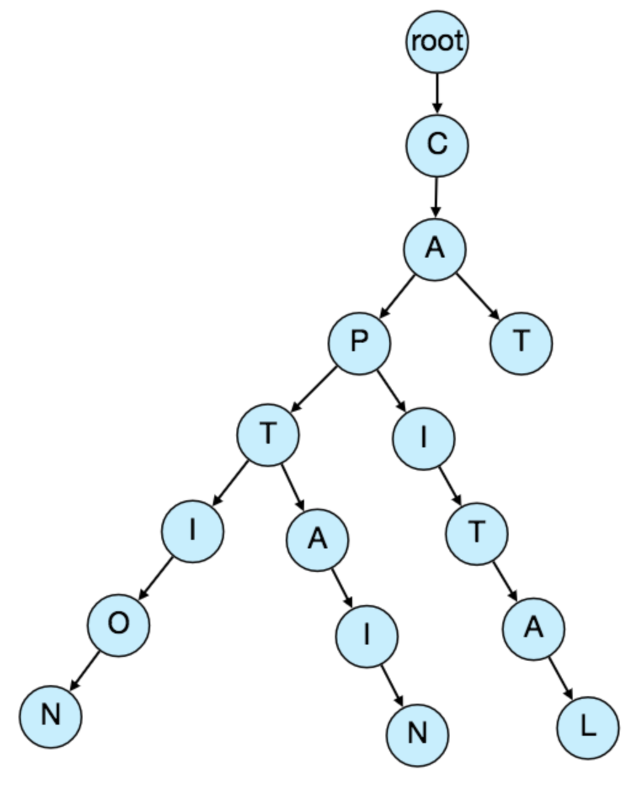
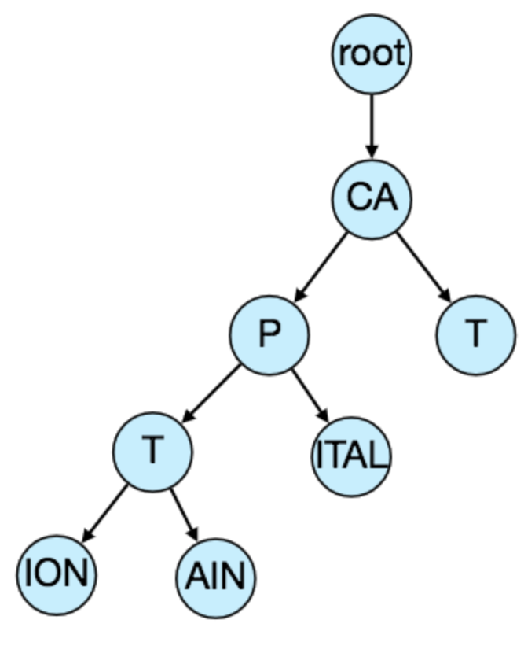

# Designing Typeahead Suggestion

Real-time suggestion service, which will recommend terms to users as they enter text for searching. Auto-suggestions, typeahead search.

---

## 1. What is Typeahead Suggestion?

Enable users to search for known and frequently searched terms. As users type into search box, tries to predict query based on characters entered and gives list of suggestions.

---

## 2. Requirements and Goals of the System

**Functional Requirements:** As user types in query, service should suggest top 10 terms starting with whatever user has typed.

**Non-Functional Requirements:** Suggestions should appear in real-time. User should be able to see suggestions within 200 ms.

---

## 3. Basic System Design and Algorithm

Since have to serve a lot of queries with minimum latency, need scheme that can efficiently store data such that it can be queried quickly. Can't depend upon some database for this, need to store index in memory in a highly efficient data structure.

One of the most appropriate data structures for this is the Trie. Tree-like data structure used to store phrases where each node stores a character of the phrase in a sequential manner. For example, if need to store 'cap, cat, caption, captain, capital' in the trie:

Now if user typed 'cap', service can traverse trie to go to node 'P' to find all terms that start with this prefix (e.g., cap-tion, cap-ital).

Can merge nodes that only have 1 branch to save storage space:

**How to find top suggestion?** How to find top 10 terms for a given prefix? 1 simple solution could be to store count of searches that terminated at each node, e.g., if users have searched about 'CAPTAIN' 100 times and 'CAPTION' 500 times, store this number with the last character of the phrase. So, to find top suggestions, traverse subtree.

**Given a prefix, how much time will it take to traverse its subtree?** Given amount of data we need to index, expect huge tree. Since we have very strict latency requirements, do need to improve efficiency.

**Can we store top suggestions with each node?** Can surely speed up searches, but will require a lot of extra storage. Can optimize by storing only references of the terminal nodes rather than storing the entire phrase.

**How would we build this trie?** Bottom up, each parent node recursively calls all child nodes to calculate their top suggestions and counts.

**How to update trie?** If we try to update our trie for every query, it'll be extremely resource intensive. 1 solution could be to update our trie offline after a certain interval.

Can have a MapReduce (MR) setup to process all logging data periodically, say every hour. These MR jobs calculate frequencies of all searched terms in the past hour. Can then update trie with this new data. Have 2 options:
1. Make a copy of the trie on each server to update it offline. Once done, can switch to start using it and discard old one.
2. Have master-slave configuration for each trie server. Can update slave while master is serving traffic. Once update complete, can make slave our new master.

**How can we update frequencies of typeahead suggestions?** Can add and subtract frequencies based on Exponential Moving Average of each term, giving more weight to latest data. After inserting new term in trie, go to terminal node of phrase and increase its frequency.

**What could be different ranking criteria for suggestions?** Freshness, user location, language, demographics, personal history, etc.

---

## 4. Permanent Storage of the Trie

**How to store trie in a file so that we can rebuild our trie easily?** Take snapshot of trie periodically and store it in a file. This enables us to rebuild a trie if server goes down. To store, can start with root node and save the trie level-by-level.

---

## 5. Data Partition

Although index can easily fit on 1 server, can still partition to meet requirements of higher efficiency and lower latencies. Few options:

### **a. Range-Based Partitioning**

Store phrases in separate partitions based on 1st letter. So, save all terms starting with letter 'A' in 1 partition, and those with 'B' in another partition, and so on.

Main problem with this approach is can lead to unbalanced servers, for instance, if 'E' has too many terms.

### **b. Partition based on maximum capacity of server**

Let's say partition our trie based on max memory capacity of servers. Keep storing data on a server as long as it has memory available. For example, 1st trie server stores all terms from 'A' to 'AABC', next server 'AABD' onwards. If 2nd server stores up to 'BXA', next server 'BXB' and so on. Can keep a hash table for this:

- Server 1: A-AABC
- Server 2: AABD-BXA
- Server 3: BXB-CDA

Can have load balancer in front of trie servers which can store this mapping an redirect traffic.

Partitioning based on max capacity can still lead to hotspots, e.g., if there are a lot of queries for terms starting with 'cap', server holding it will have high load.

### **c. Partition based on hash of the term**

Each term passed to a hash function, which generates a server number to store term in. This will make our term distribution random and hence minimize hotspots. Disadvantage is, to find typeahead suggestions for a term, have to ask all the servers and then aggregate the results.

---

## 6. Cache

Caching top searched terms will be extremely helpful. Can have separate cache servers in front of trie servers holding most frequently searched terms and typehead suggestions. Application servers should check cache servers before hitting trie servers.

---

## 7. Replication and Load Balancer

Should have replicas for trie servers both for load balancing and also for fault tolerance. Need load balancer that keeps track of our data partitioning scheme and redirect traffic.
