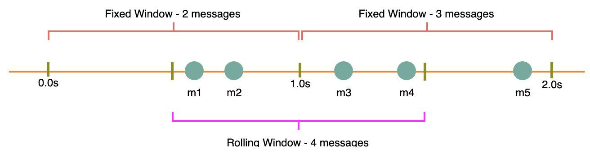
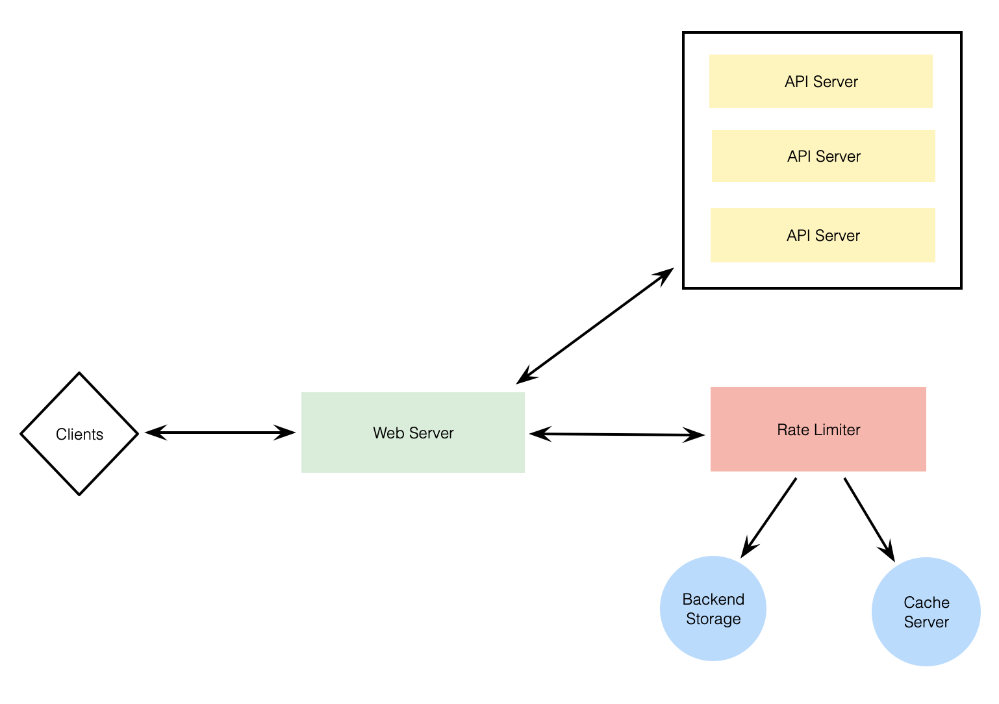
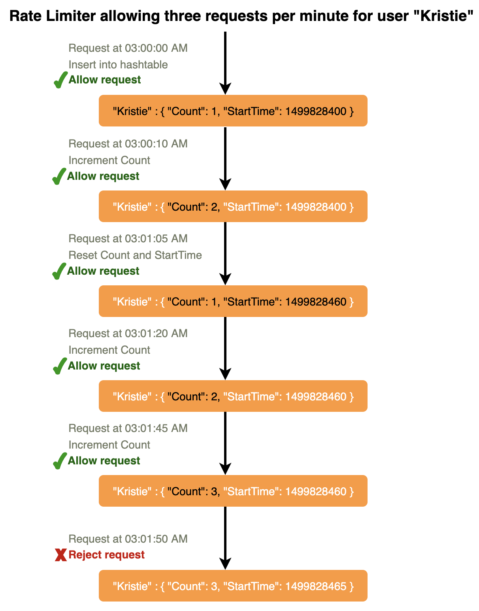
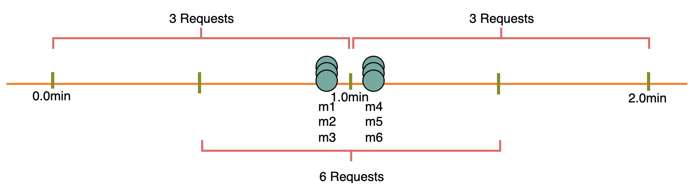
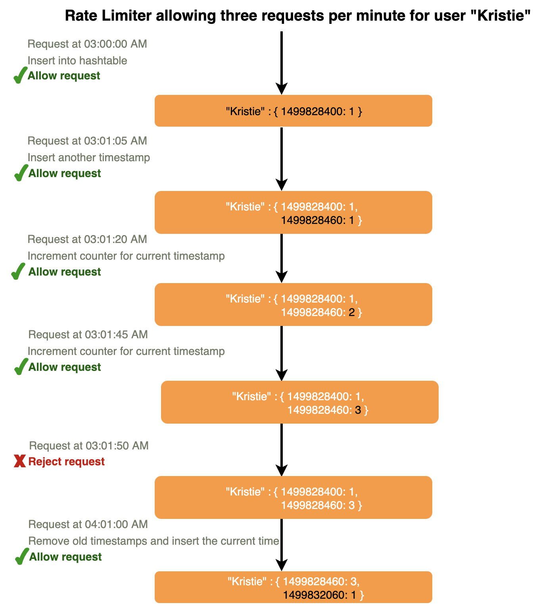

# Designing an API Rate Limiter

Throttle users based on the number of requests they are sending.

---

## 1. What is a Rate Limiter?

Throttling or rate limiting mechanism to allow only a certain number of requests so our service can respond to all of them.

---

## 2. Why do we need API rate limiting?

Protect services against abusive behaviors targeting the application layer like denial-of-service (DOS) attacks, brute-force password attempts, brute-force credit card transactions, etc. Also used to prevent revenue loss, reduce infrastructure costs, stop spam, and stop online harassment.

---

## 3. Requirements and Goals of the System:

**Functional Requirements:**
1. Limit number of requests an entity can send to an API within a time window, e.g., 15 requests per second.
2. APIs are accessible through a cluster, so the rate limit should be considered across different servers.

**Non-Functional Requirements:**
1. Highly available, rate limiter should always work since it protects us from external attacks.
2. Shouldn't introduce substantial latencies affecting user experience.

---

## 4. How to do rate limiting?

Throttling is the process of controlling usage of the APIs during a given period. Can be defined at the application level and/or API level. When a throttle limit is crossed, server returns HTTP status "429 - Too many requests".

---

## 5. What are different types of throttling?

3 types: hard throttling (hard limit), soft throttling (certain % above limit), elastic or dynamic throttling (dependent on available resources).

---

## 6. What are different types of algorithms used for rate limiting?

2 types:

**Fixed Window Algorithm:** Time window is considered from start of time unit to end of time unit. In diagram below, 2 messages between 0-1 second, and 3 messages between 1-2 seconds. If have rate limiting of 2 messages/second, throttle 'm5'.



**Rolling Window Algorithm:** Time window is considered from fraction of time at which request is made + time window length. In above diagram, keeping 2 messages/second, throttle 'm3' and 'm4'.

---

## 7. High Level Design

Rate limiter responsible for deciding which request will be served by API servers and which request will be declined. Once new request arrives, web server first asks rate limiter to decide if it will be served or throttled. If not throttled, then it'll be passed to API servers.



---

## 8. Basic System Design and Algorithm

For each unique user, keep a count representing how many requests user has made and a timestamp when we started counting. Keep it in a hash table, where `key` is `UserID`, and `value` is a structure containing an integer for the `Count` and an integer for the Epoch time:

```
Key: Value
UserID: {Count, StartTime}

E.g.,
Kristie: {3, 1499818564}
```

Assume rate limiter allowing 3 requests per minute per user, so whenever new request comes in, performs following steps:

1. If `UserID` not in hash table, insert it with `Count` to `1`, set `StartTime` to current time, and allow request.
2. Else, find record of `UserID`, and if `CurrentTime - StartTime >= 1 min`, set `StartTime` to current time, `Count` to `1`, and allow request.
3. If `CurrentTime - StartTime <= 1 min`, and:
    - If `Count < 3`, increment `Count` and allow request.
    - Else, reject request.



**What are some problems with our algorithm?**

1. This is a **Fixed Window** algorithm since resetting `StartTime` at the end of every minute, can potentially allow twice the number of requests per minute. Solution to this problem would be a sliding window algorithm (later).



2. **Atomicity:** "Read-and-then-write" behavior can create a race condition. If Kristie's current `Count` is `2` and issues 2 more requests, if 2 separate processes served each of these requests and concurrently read the count before either updated, each would think she could have 1 more request and did not hit rate limit.


If using Redis to store our key-value, 1 solution to resolve atomicity problem is to use Redis lock for duration of read-update operation. This, however, would come at expense of slowing down concurrent requests from same user and introducting another layer of complexity.

If using simple hash table, can have custom implementation for 'locking' each record.

**How much memory would we need to store all user data?**

Assume simple solution where keeping all data in a hash table. This can easily fit on a single server, however, wouldn't like to route all traffic through a single machine. Practically, assume would use a Redis or Memcached kind of solution. Store all data in remote Redis servers and all rate limiter servers will read (and update) these servers before serving or throttling any request.

---

## 9. Sliding Window Algorithm

Maintain sliding window if we can keep track of each request per user. Store timestamp of each request in a Redis Sorted Set in `value` field of hash table:

```
Key: Value
UserID: {Sorted Set<UnixTime>}

E.g.,
Kristie: {1499818000, 1499818500, 1499818860}
```

Assume rate limiter allowing 3 requests per min per user, so whenever new request comes in:
1. Remove all timestamps from sorted set older than `CurrentTime - 1 min`.
2. Count total number of elements in sorted set. Reject request if count is greater than throttling limit of `3`.
3. Insert current time in sorted set and accept request.


**How much memory to store all user data for sliding window?**

In a sorted set, need at least 2 pointer to maintain order among elements - 1 pointer to previous element and 1 to next element. Sliding window algorithm takes a lot of memory compared to fixed window, this would be a scalability issue. What if we combine the above 2 algorithms to optimize memory usage?

---

## 10. Sliding Window with Counters

Keep track of request counts for each user using multiple fixed time windows, e.g., 1/60th the size of our rate limit's time window. For example, if have an hourly rate limit, can keep a count for each minute and calculate sum of all counters in past hour when we receive a new request.

Can store counters in a Redis Hash since it offers incredibly efficient storage for fewer than 100 keys. When each request increments a counter in the hash, it also sets the hash to expire an hour later.



**How much memory we would need to store all user data for sliding window with counters?**

Using `UserID`, epoch time, counter, hash table, Redis hash, after math ends up using 86% less memory.

---

## 11. Data Sharding and Caching

Shard based on `UserID` to distribute user's data. For fault tolerance and replication should use consistent hashing. If want different throttling limits for different APIs, can choose shard per user per API.

If APIs partitioned, practical consideration could be to have a separate (somewhat smaller) rate limiter for each API shard as well.

System can get huge benefits from caching recent active users. Application servers can quickly check if cache has desired record before hitting backend servers. Rate limiter can significantly benefit from a **write-back cache** by updating all counters and timestamps in cache only. Least Recently Used (LRU) can be a reasonable cache eviction policy.

