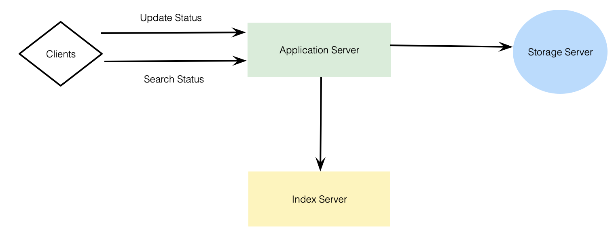
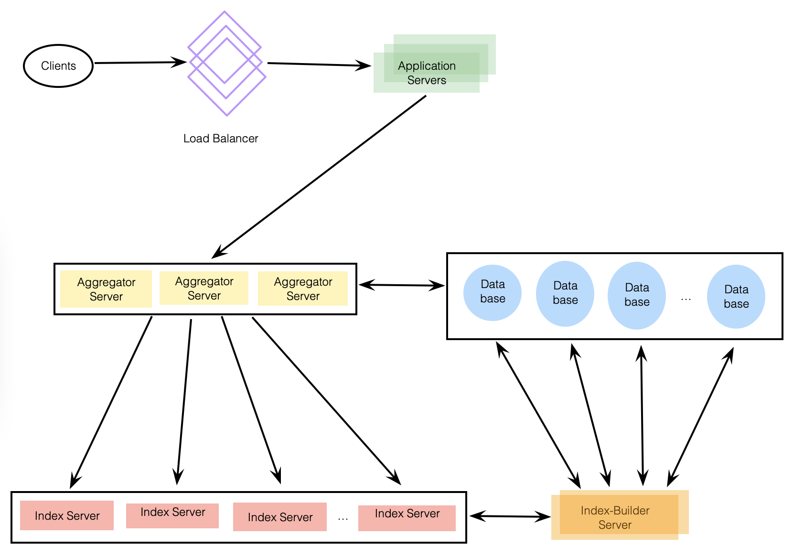

# Designing Twitter Search

Store and search user tweets.

---

## 1. What is Twitter Search?

Each tweet consists of plain text and goal is to design a system that allows searching over all user tweets.

---

## 2. Requirements and Goals of the System

- Assume 1.5 billion total users with 800 million daily active users.
- On average 400 million tweets every day.
- Assume 500 million searches every day.
- Search query will consist of multiple words combined with AND/OR.

Need to design a system that can efficiently store and query tweets.

---

## 3. Capacity Estimation and Constraints

**Storage:** 400 million new tweets every day, assume each tweet on average 300 bytes:

`400 million * 300 = 120 GB/day ~= 1.38 MB/second`

---

## 4. System APIs

Search API:

`search(apiDevKey, searchTerms, maximumResultsToReturn, sort = None, pageToken)`

**Required Parameters:**
- apiDevKey (string): API developer key of account, will be used to, among other things, throttle based on allocated quota.
- searchTerms (string): String containing search terms.
- maximumResultsToReturn (number): Number of tweets to return.
- pageToken (string): Specify page in result set that should be returned.

**Returns:** (JSON)
JSON containing info about list of tweets matching search query. Each result entry can have user ID and name, tweet text, tweet ID, creation time, number of likes, etc.

---

## 5. High Level Design

At a high level, need to store all statuses in database and build an index that can keep track of which word appears in which tweet. This index will help us quickly find tweets that users are trying to search.

---

## 6. Detailed Component Design

### **1. Storage**

Huge amount of data, need to come up with data partitioning scheme to efficiently distribute data onto multiple servers. Assume we also keep an extra copy of all tweets for fault tolerance.

Start with simplistic design where we store tweets in a MySQL database. Assume store tweets in a table with 2 columns, TweetID and TweetText. Assume partition data based on TweetID. If TweetIDs are unique system-wide, can define hash function to map TweetID to storage server where we can store that tweet object.

**How can we create system-wide unique TweetIDs?**

Assume have service that can generate a unique TweetID whenever we need to store an object (TweetID discussed here similar to TweetID in Designing Twitter). Can feed TweetID to hash function to find storage server and store tweet object there.

### **2. Index**

Since tweet queries consist of words, build index that can tell us which word comes in which tweet object. Assume want to build an index for all English words and some famous nouns like people names, city names, etc. 

Index would be like a big distributed hash table, where `key` would be the word, and `value` will be a list of TweetIDs of all those tweets which contain that word.

Can partition the data, 2 options:

**Sharding based on words:** When building index, iterate through all words of a tweet and calculate hash of each word to find server where it would be indexes. To find all tweets containing a specific word, have to query only the server which contains this word.

Issues:
1. What if a word becomes hot? Then there will be a lot of queries on the server, high load will affect performance.
2. Over time, some words can end up storing a lot of TweetIDs, maintaining a uniform distribution of words while tweets are growing will be an issue.

To recover from these situations, either re-partition data or use consistent hashing.

**Sharding based on tweet object:** While storing, pass TweetID to hash function to find server and index all the words of the tweet on that server. While querying for a particular word, have to query all servers, and each server will return a set of TweetIDs. A centralized server will then aggregate these results to return them to the user.

---

## 7. Fault Tolerance

What happens when an index server dies? Can have a secondary replica of each server, and if primary server dies, can take control after failover.

What if both primary and second servers die? Have to allocate a new server and rebuild same index on it. How? Would have to brute-force iterate through whole database and filter TweetIDs using hash function. Inefficient, during rebuild wouldn't be able to query, miss tweets.

How can we efficiently retrieve mapping between tweets and index server? Have to build a reverse index that will map all TweetIDs to their index server. Index-Builder server can hold this info. Build hash table where `key` will be the server number, and `value` will be a hash set containing all the TweetIDs being kept at that index server.

With this setup, can add/remove tweets from index quickly. Fast. Also have a replica of Index-Builder server for fault tolerance.

---

## 8. Cache

To deal with hot tweets, introduce a cache in front of database. Can use Memcached, which can store all such hot tweets in memory. For cache eviction policy, Least Recently Used (LRU) seems suitable.

---

## 9. Load Balancing

Can add load balancing in 2 places:
1. Between clients and application servers.
2. Between application servers and backend server.

Initially, simple round robin approach can be adopted, distributes incoming requests equally among backend servers. Simple, no overhead, will take out dead servers from rotation. Problem is it won't take server load into consideration, if a server is slow, LB will not stop sending new requests to it. To handle this, periodically query backend server about their load and adjust traffic.
