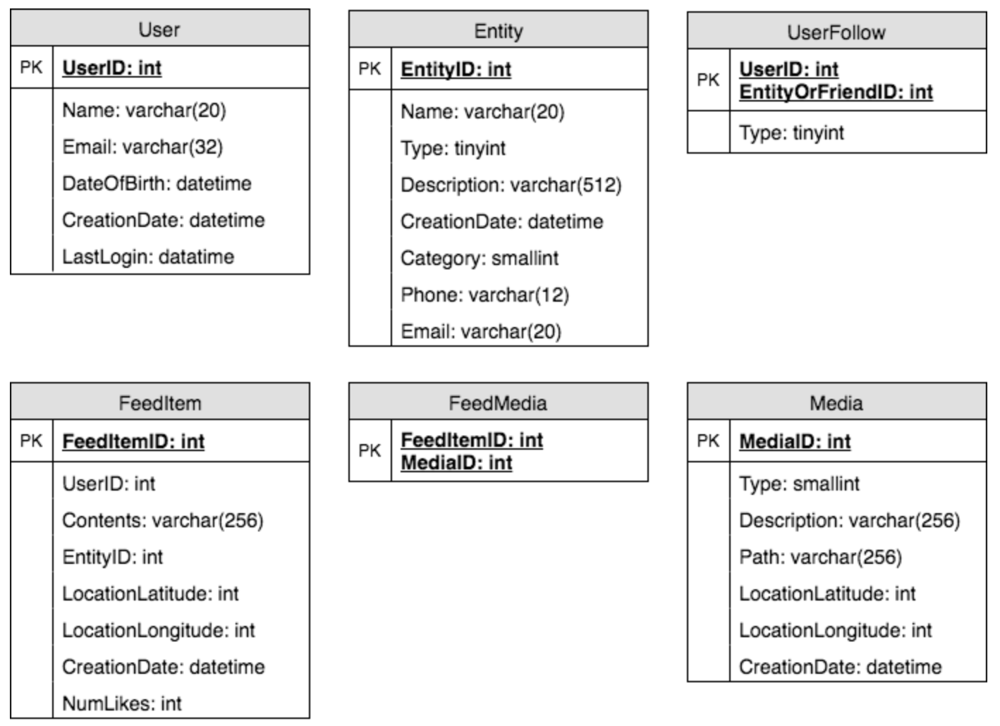
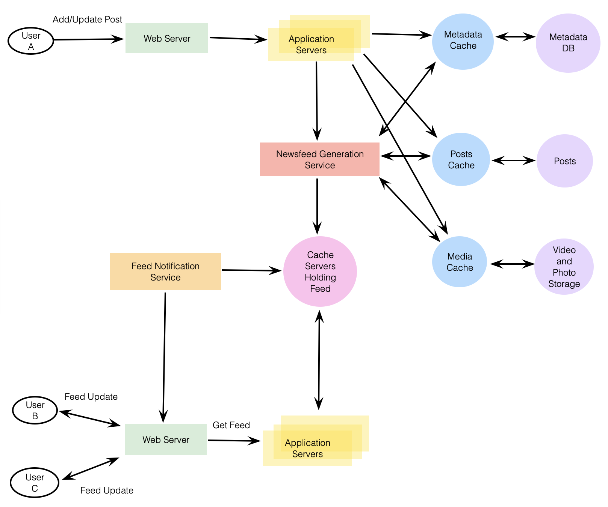
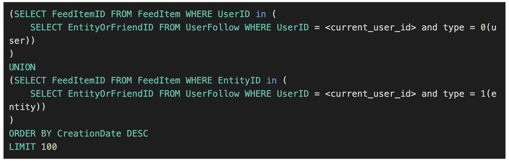

# Designing Facebook's Newsfeed

Contains posts, photos, videos, and status updates from all the people and pages a user follows.

---

## 1. What is Facebook's Newsfeed?

Constantly updating list of stories in the middle of Facebook's homepage. Includes status updates, photos, videos, links, app activity, and 'likes' from people, pages, and groups that a user follows.

---

## 2. Requirements and Goals of the System

**Functional Requirements:**
1. Newsfeed will be generated based on posts from the people, pages, and groups that a user follows.
2. User may have friends and follow a large number of pages/groups.
3. Feeds may contain images, videos, or just text.
4. Support appending new posts as they arrive to the newsfeed for all active users.

**Non-Functional Requirements:**
1. Generate any user's newsfeed in real-time - maximum latency seen by the end user would be 2 seconds.
2. Post shouldn't take more than 5 seconds to make it to a user's feed assuming a new newsfeed request comes in.

---

## 3. Capacity Estimation and Constraints

Assume on average user has 300 friends and follows 200 pages.

**Traffic Estimates:** Assume 300 million daily active users with each user fetching an average of 5 times a day. Results in 1.5 billion newsfeed requests per day or approx. 17,500 requests per second.

**Storage Estimates:** On average, assume need to have around 500 posts in every user's feed to keep in memory for a quick fetch.

---

## 4. System APIs

Following could be definition of API for getting the newsfeed:

`getUserFeed(apiDevKey, userID, sinceID = 0, count = 200, maxID = 0, excludeReplies = false)`

**Required Parameters:**
- apiDevKey (string): API developer key of user, to be used, among other things, throttle based on allocated quota.
- userID (number): ID of user for whom system will generate the newsfeed.

**Returns:** (JSON): Returns a JSON object containing a list of feed items.

---

## 5. Database Design

3 primary objects: `User`, `Entity` (e.g., page, group, etc.), and `FeedItem` (or `Post`). Observations:
- A `User` can follow other `Entities` and can become friends with other `Users`.
- Both `Users` and `Entities` can post `FeedItems` which can contain text, images, or videos.
- Each `FeedItem` will have a `UserID` which points to the `User` who created it. Assume only `users` can create `FeedItems`.
- Each `FeedItem` can optionally have an `EntityID` pointing to the page or group where that post was created.

If using relational database, would need to model 2 relations: `User-Entity` and `FeedItem-Media`. Since each user can be friends with many people and follow a lot of entries, store this relation in a separate table. 



---

## 6. High Level System Design

At a high level can be divided into 2 parts:

**Feed Generation:**

Newsfeed generation from posts of users and entities that a user follows. So, whenever system receives a request to generate the feed for a user (say Jane), perform following steps:
1. Retrieve IDs of all users and entities that Jane follows.
2. Retrieve latest, most popular and relevant posts for those IDs. These are the potential posts that we can show in Jane's newsfeed.
3. Rank posts based on relevance to Jane.
4. Store feed in cache and return top posts (say 20) to be rendered on Jane's feed.
5. On frontend, when Jane reaches end of feed, fetch next 20 posts from server, and so on.

Notice generated feed once and stored in cache. What about new incoming posts? If Jane online, have a mechanism to rank and add those new posts to feed. Periodically (say every 5 mins) perform above steps to rank and add new posts.

**Feed Publishing:**

Whenever Jane loads newsfeed, has to request and pull feed items from server. When reaches end of current feed, can pull more data from server.

At a high level, need the following components for newsfeed service:
1. **Web Servers:** To maintain connection with user to transfer data between user and server.
2. **Application Server:** To execute workflows of storing new posts in database servers, also to retrieve and push newsfeed to end user.
3. **Metadata Database and Cache:** To store metadata about users, pages, and groups.
4. **Posts Database and Cache:** To store metadata about posts and their contents.
5. **Video and Photo Storage and Cache:** Blob storage, to store all media included in posts.
6. **Newsfeed Generation Service:** To gather and rank all relevant posts for a user to generate newsfeed and store in cache. Also receive live updates and add newer feed items to any user's timeline.
7. **Feed Notification Service:** To notify user there are newer items available for newsfeed.

Following is high-level architecture diagram. User B and C are following User A.



---

## 7. Detailed Component Design

### **a. Feed Generation**

Take simple case of newsfeed generation service fetching most recent posts from all users and entites Jane follows:



Issues:
1. Crazy slow for users with a lot of friends/follows.
2. We generate timeline when user loads page, slow and high latency.
3. Each status update results in feed updates for all followers, could result in high backlogs.
4. Server pushing newer posts could lead to very heavy loads. To improve efficiency, can pre-generate timelines and store in memory.

**Offline generation for newsfeed:** Can have dedicated servers that continuously generate users' newsfeed and store in memory. Whenever servers need to generate feed, first query to see last time feed was generated for that user. Then, new feed data would be generated from that time onwards. Can store this data in a hash table, where `key` is `UserID` and `value` would be a `Struct` like this:

```
Struct {
    LinkedHashMap<FeedItemID, FeedItem> feedItems;
    DateTime lastGenerated;
}
```

Whenever users want to fetch more feed items, send last `FeedItemID` they currently see in newsfeed, then we can jump to that `FeedItemID` in hash map and return next batch/page of feed items from there.

**How many feed items should we store in memory for a user's feed?** Initially, can store 500, then adjust later based on usage pattern.

### **b. Feed Publishing**

Process of pushing a post to all followers is called a fanout. By analogy, push approach is called fanout-on-write, while pull approach is called fanout-on-load. So, 2 options:

1. **"Pull" model or fanout-on-load:** Keep all recent feed data in memory so users can pull it from server when needed. Possible problems: a) new data might not be shown to users until they issue a pull, b) hard to find right pull cadence, as most of the time pull requests return in empty response if no new data, waste of resources.

2. **"Push" model or fanout-on-write:** Once user published a post, can immediately push to all followers. Advantage is that when fetching feed, don't need to go through friend's list and get feeds for everyone. Also significantly reduces read operations. To efficiently handle this, maintain long poll reqeust with server for receiving updates. Possible problem is for users with millions of followers, server has to push updates to a lot of people.

3. **Hybrid:** Stop pushing posts from users with high number of followers (celebrities) and only push data for those users who have a few hundred (or thousand) followers. For celebrities, can let followers pull updates. Since push operation can be extremely costly, disabling fanout will save huge number of resources. Another approach could be limit fanout to only online friends.

**How many feed items can we return to client in each request?** Should have a max limit (say 20), but should let client specify how many feed items they want with each request (e.g., more on desktop vs. mobile).

**Should we always notify users if there are new posts available?** Give the option, since for example on mobile, can consume unnecessary bandwidth, so let users "Pull to Refresh" to get new posts.

---

## 8. Data Partitioning

**a. Sharding Posts and Metadata**
Since huge number of new posts every day and read load extremely high, need to distribute data onto multiple machines. For sharding databases storing posts and metadata, have similar design to Designing Twitter.

**b. Sharding Feed Data**
Partition it based on `UserID`. Can try storing all data of a user on 1 server. When storing, pass `UserID` to hash function to map user to a cache server where user's feed objects are stored. For future growth and replication, must use consistent hashing.
