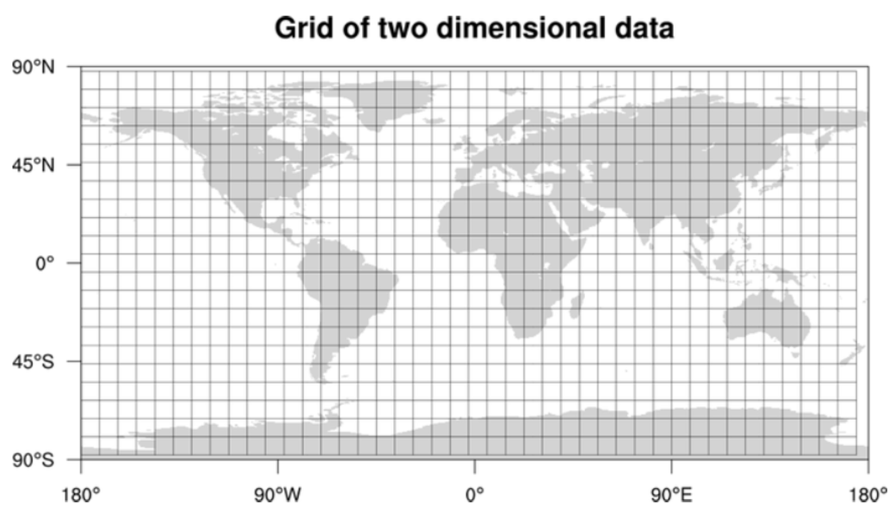
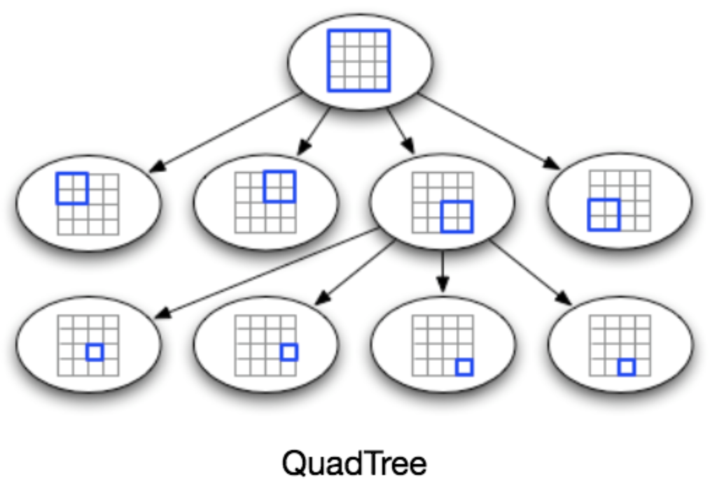
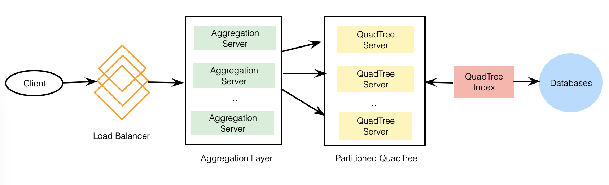

# Designing Yelp or Nearby Friends

Search for nearby places like restaurants, threaters, or shopping malls. Can also add/view reviews of places.

---

## 1. Why Yelp or Proximity Server?

Discover nearby attractions like places, events, etc.

---

## 2. Requirements and Goals of the System

**Functional Requirements:**
1. Add/delete/update places.
2. Given location, find all nearby places within given radius.
3. Add feedback/view about places. Feedback can have pictures, text, and a rating.

**Non-Functional Requirements:**
1. Real-time search experience with minimum latency.
2. Support heavy search load. Lots of search requests compared to adding a new place.

---

## 3. Scale Estimation

Assume 500 million places and 100,000 queries per second (QPS). Assume 20% growth in number of places and QPS each year.

---

## 4. Database Schema

Each place can have the following fields:
1. LocationID: Uniquely identifies a location.
2. Name
3. Latitude
4. Longitude
5. Description
6. Category: E.g., coffee shop, restaurant, theater, etc.

Also need to store reviews, photos, and ratings of a place. Can have separate table to store reviews for places.
1. LocationID
2. Review ID: Uniquely identifies a review.
3. ReviewText
4. Rating
Similarly, can have separate table to store photos for places and reviews.

---

## 5. System APIs

Definition of API for searching:

`search(apiDevKey, searchTerms, userLocation, radiusFilter = 10 km, maximumResultsToReturn, categoryFilter = None, sort = None, pageToken)`

**Required Parameters:**
- apiDevKey (string): API developer key of account used to, among other things, throttle users based on allocated quota.
- searchTerms (string): String containing search terms.
- userLocation (string): Location of user performing the search.
- maximumResultsToReturn (number): Number of business results to return.
- pageToken (string): Specify page in result set that should be returned.

**Returns:** (JSON)
JSON containing info about list of businesses matching search query. Each result entry will have business name, address, category, rating, and thumbnail.

---

## 6. Basic System Design and Algorithm

At a high level, need to store and index each dataset (places, reviews, etc.). For users to query this massive databse, indexing should be read efficient. Different ways to store this data:

### **a. SQL Solution**

1 simple solution is to store all data in a database like MySQL. Each place stored in a separate row, uniquely identified by LocationID. Each place will have longitude and latitude stored separately in 2 different columns. To find all nearby places of a given location `(X, Y)` within a radius `D`, can query like:

`Select * from Places where Latitude between X-D and X+D and Longitude between Y-D and Y+D`

**How efficient would this query be?** Since 2 separate indexes, each index can return a huge list of places and performing an intersection won't be efficient. Should find some way to shorten these lists to improve performance.

### **b. Grids**

Divide whole map into smaller grids to group locations into smaller sets. Each grid will store all places residing within specific range of longitude and latitude. Enables us to query only a few grids to find nearby places.

Assume `GridID` would uniquely identify grids.

**What could be a reasonable grid size?** Could be equal to distance we would like to query since also want to reduce number of grids. If grid size equal to distance, then only need to search within grid which contains given location.

In database, can store `GridID` with each location and have an index on it too for faster searching. New query:

`Select * from Places where Latitude between X-D and X+D and Longitude between Y-D and Y+D and GridID in (GridID, GridID1, GridID2, ..., GridID8)`

**Should we keep our index in memory?** Maintaining index in memory will improve performance. Can keep index in hash table where `key` is grid number and `value` is list of places contained in that grid.

**How much memory will we need to store index?** A lot, especially for dense and thick areas with a lot of places. Solve this by dynamically adjusting grid size such that whenever we have a grid with a lot of places, break it down to create smaller grids.

### **c. Dynamic Size Grids**

Assume don't want more than 500 places in a grid for faster searching. Thickly populated areas like NYC will have a lot of grids, but sparsely populated areas like Pacific Ocean will have large grids.

**What data structure can hold this info?** A tree, where each node has 4 children. Each node represents a grid and contains info about it. If node reaches limit of 500 places, break it down to create 4 more nodes.

**How to find grid for given location?** Start at root and search downward until leaf node, choosing node with desired location each time.

**How to find neighboring grids?** Connect all leaf nodes with a doubly linked list, can iterate forward or backward among neighbor leaf nodes. Another approach would be through parent nodes, keep pointer in each node to parent.

---

## 7. Data Partitioning

What if we have huge number of places? Need to partition QuadTree. 2 solutions:

### **a. Sharding based on regions:**
Divide places into regions such that all places belonging to a region will be stored on a fixed node. Couple of issues:
1. What if a region becomes hot? A lot of queries, slow, will affect performance.
2. Over time, some regions can end up storing a lot of places, so maintaining a uniform distribution of places would be hard.

To recover from these, either re-partition or use consistent hashing.

### **b. Sharding based on LocationID:**
Hash function will map each `LocationID` to a server where we store that place. When building tree, iterate through all places and calculate hash of each `LocationID` to find server. To find places nearby, have to query all servers and each server returns a set of nearby places. A centralized server will aggregate results to return them.

---

## 8. Replication and Fault Tolerance

To distribute read traffic, can have replicas of each QuadTree server. Can have master-slave config where replicas (slaves) will only serve read traffic; all write traffic will first go to master then slaves. If a server dies, can have a secondary replicas of each to take control.

**How to efficiently retrieve mapping between places and server?** Build reverse index that will map all places to their server. Can have separate index server to hold this info.

---

## 9. Cache

To deal with hot places, introduce cache in front of database. Can use for example Memcached to store all data about hot places. For cache eviction policy, Least Recently Used (LRU) cache seems suitable.

---

## 10. Load Balancing (LB)

Add in 2 places:
1. Between clients and application servers.
2. Between application servers and backend server.

Initially, simple Round Robin approach can be adopted to distribute all incoming requests equally. Simple, no overhead, would take dead servers out of rotation.

A problem is won't take server load into consideration. If server overloaded, LB will keep sending requests. To handle this, periodically query backend server about load and adjust traffic accordingly.
