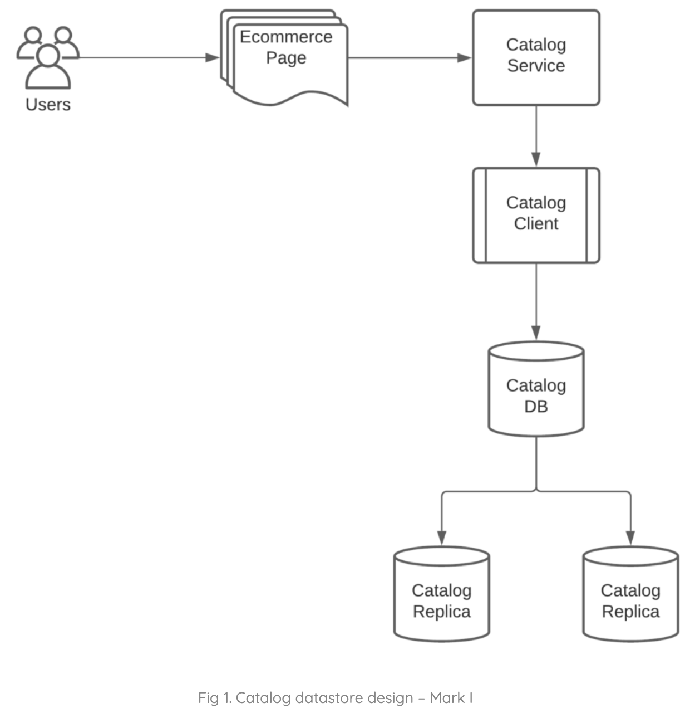
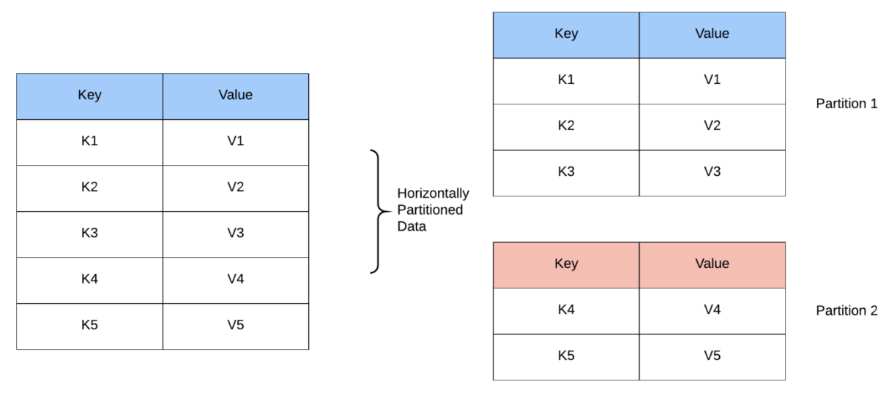
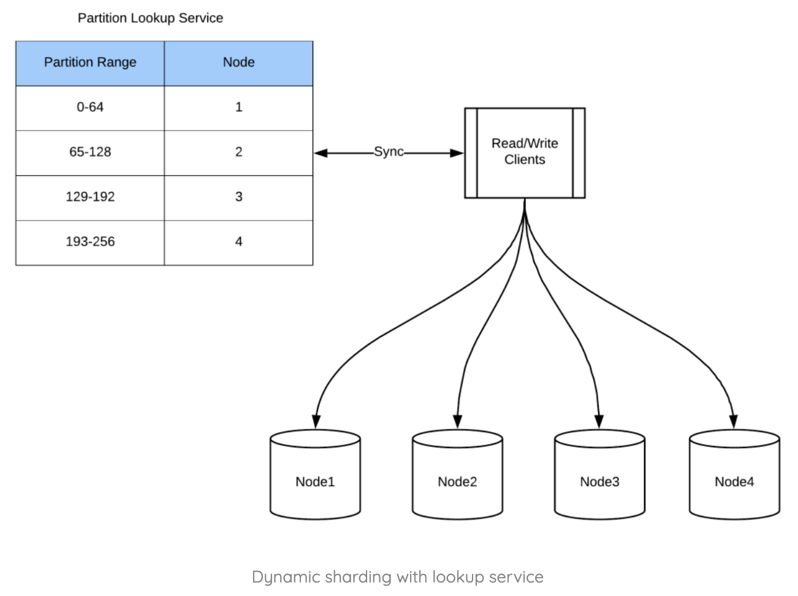
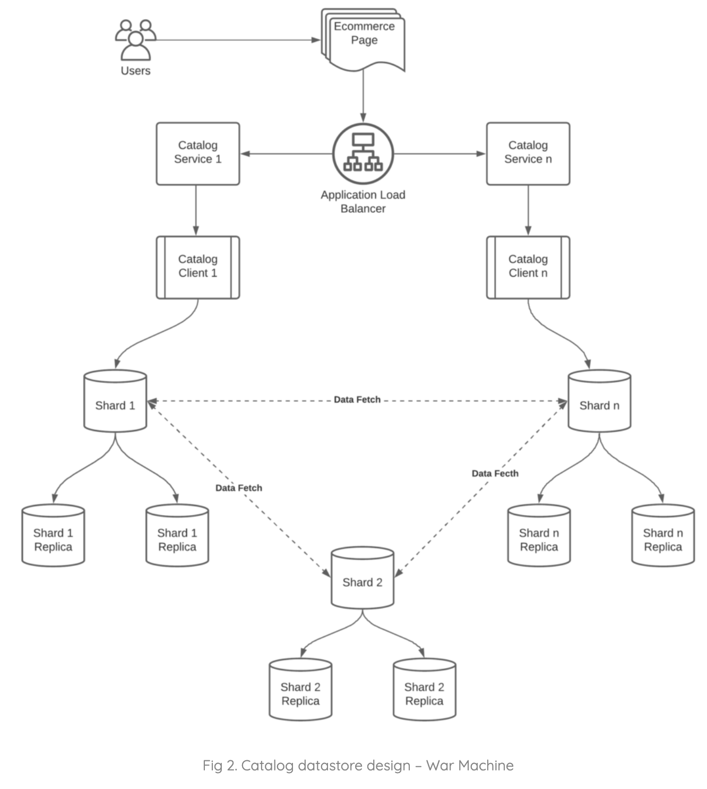
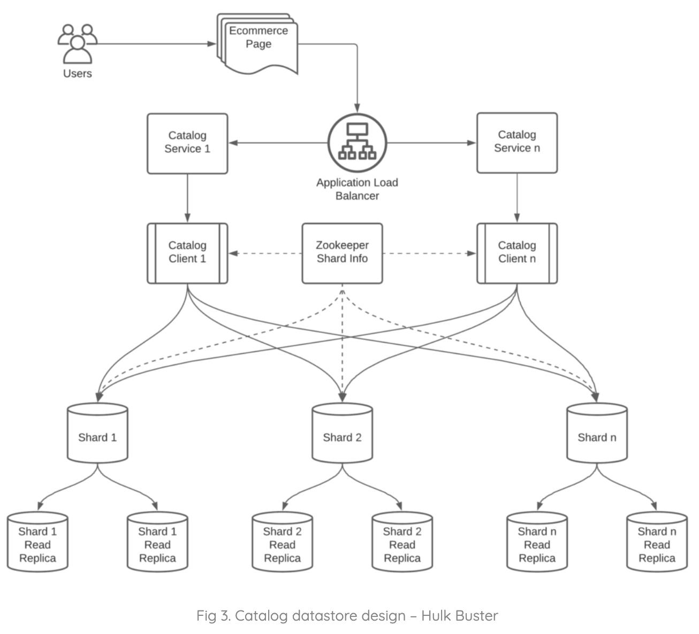
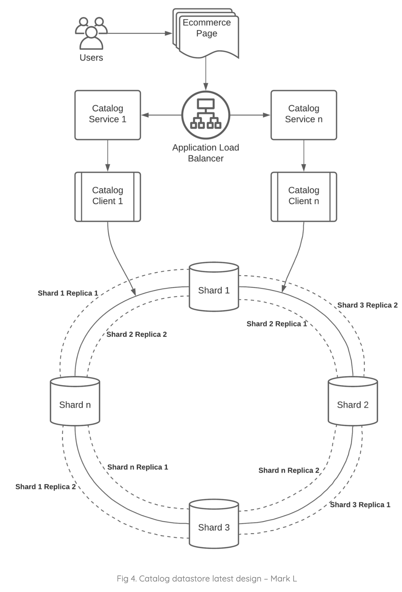

# E-Commerce Website

## 1. What/Why

Design a data store for products of an e-commerce website.

---

## 2. Requirements and Goals of the System

- Should be able to store 10s of millions of product details.
- Should be able to serve 100,000 QPS, 2x or max QPS.
- Should not have any data loss.

---

## 3. Mark 1 (V1)

### Database

- Can use MySQL DB which will be able to support all our requirements.
- Create data model for product and store it in a simple MySQL DB which has replicas for data resiliency.

### Client Behavior

Can connect directly to DB from backend service and query products to serve the requests.

### Design

Simple design, will work for low-scale use cases. Now, say website is gaining traction, seeing more users, now customers start to complain it is slow.

1 thing to do to reduce latency is to add more backend services, and put them in front of a load balancer. Works well, great. Now, let's say in 6 months, customers has grown 2x. Adding more service instances doesn't help anymore, because DB starting to degrade.

When DB reaches max throughput, can't squeeze more juice from it. Another trick to improve latency: caching. Add caching on top of the DB to reduce load on DB. Works well.

But now, our PMs decided to add more categories, e.g., gadgets, mobiles, computers, etc., and more importantly, want to become a marketplace rather than a retailer. Now, realize that current design will not fit all products in a single DB machine. Time to re-design.

---

## 4. War Machine (V2)

Need to re-design data store to support millions of products and 100,000+ sellers. In traditional MySQL DBs, will be difficult to scale, as it only allows vertical scaling, by increasing RAM and HDD/SDD, limitations.

So now, decide to scale horizontally. Now, if more products are being onboarded, we can easily scale out with data sharding.

### Data Sharding

Sharding is a data partitioning strategy for distributing data to multiple servers, where data can't fit in 1 server.

**When can you shard?** When data is too large to fit on 1 server, and when there's too many writes and I/O can't scale with only 1 server.

**Types of Sharding**

**Hash-Based Sharding:** In hash-based sharding, use primary key of the data to identify the partition/shard it belongs to. Also known as application sharding, as the app will be able to identify the shard using a hash function.

`partitionId = hashFunction(key) % numberOfShards`

**Dynamic Sharding:** Main drawback of above is data growth in particular shards/partitions. Let's assume partition1 has more data than it can  fit in 1 box, then need to re-partition the data in server and distribute to multiple servers, and also need to change the partition algorithm to address the re-partition data. Dynamic sharding is an extension of hash-based sharding, where an external lookup service is used for mapping details of `partitionId` and `nodeId`.

Let's assume data growth surpasses the range. Can address in 2 ways:
1. Add a node and break the partition range to 0-32 in node1 and 33-64 in a new node.
2. Re-distribute data to available nodes.

This gives flexibility to re-distribute data among nodes without affecting clients.

**Entity Group Sharding:** Main drawback above is, since queries may require join, and data is distributed, then will need to fork and join across multiple nodes, expensive. Entity group sharding overcomes this by storing data relevant to the key in the same shard for multiple tables/entities.

**Pitfalls For Sharding**

- Hot spotting, ex. assume designing Twitter/Instagram, and have `userId` as shard key for posts, if user is celebrity, then shard which has their posts will suffer from hot spotting.
- Sharding is operationally heavy and complex.

### Design

Have solved problem of scaling, but when number of products increases, then amount of exchange between data store increases, which starts to reduce performance of data store. Also all node info was needed by clients to connect.

## 5. Hulkbuster (V3)

Introduce Apache ZooKeeper to store all node info about data store and update nodes when there are changes in shards. Clients can instead connect to ZooKeeper to update node info, which doesn't require downtime. Also, can make client aware of sharding algorithm so that we can decouple logic from shards to identify the primary shard.

In this design, client fetches shard info from ZooKeeper and uses sharding algorithm to find `shardId`, then uses node info to call primary shards for all keys by scatter gathering. Reduces info exchange between shards significantly and increases performance.

### Design

Works well for a long time, no issues with scaling, until PMs decided to add another vertical which is a huge category, apparel.

Consider a t-shirt, available in 4 colors and 4 different sizes, 16 products for mens, then consider women, kids, and then scale to millions of t-shirts. Massive amount of data, current sharding may not work, need to re-think design.

## 6. Mark L (V4)

Pain points with design above:
- Any change in the shard is always complicated, requires re-sharding which could lead to downtime.
- Writes were affected in current sharding if primary shard goes down.
- Rebalancing shard is painful.

Need dynamic sharding capabilities and resilience to node failures, solution: consistent hashing. Arrange all shards in a ring in ascending order, with the nodes also present.

### Consistent Hashing

Use client's key to identify position in the hash ring and move clockwise to find the node available, this will be the primary shard/node for a given key. In this approach, don't need to know which node is primary, keeps things simple.

Store replicas in subsequent nodes present in clockwise in the hash ring. Say we have a replication factor of 2, then store data in 2 adjacent subsequent nodes.

Final design, meets all of our needs and requirements.

- Can add more nodes to scale the shards.
- When nodes go down, then immediate replica can take over, so node failure will not impact any customers with downtime.
- Can have asymmetrical nodes for flexibility.
