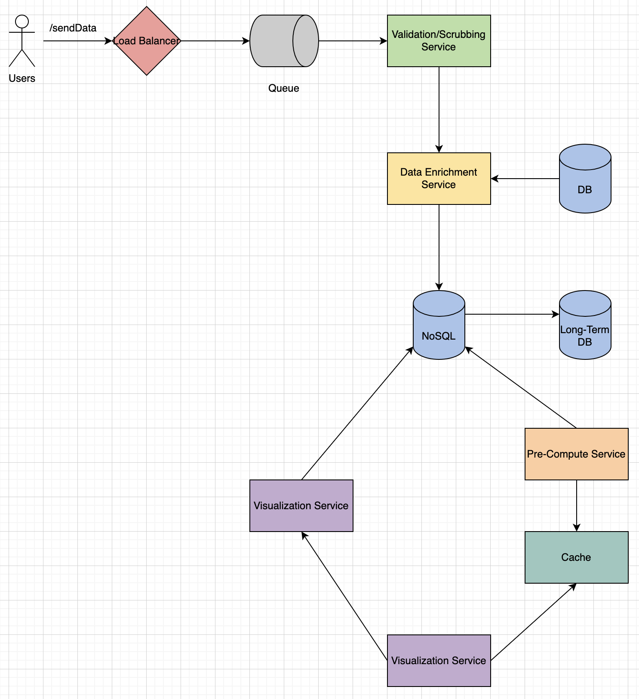

# Logging

## 1. What/Why

- Log user events when using a product.
- Takes in events, records important events, and passes it to people who care about this data.

---

## 2. Requirements and Goals of the System

**Functional:**

- Agnostic of platform (web, desktop, mobile, etc).
- Data configurable (different use cases, different data, changing). Ex. onboarding process in sign-ups and looking at different places where users drop off, or dashboard and trying to see which components user interacts with, or big form and seeing how far users get before dropping.
- Visualization.

**Non-Functional:**

- Highly available.
- Low latency (near real-time). Ex. need info quickly to make business decisions, or dealing with money and can't afford to have lag (fraud, important payments).
- Validation of data.

---

## 3. System APIs

```
Payload (a log)

sendData(request)

POST API

request: {
    "page":,
    "timestamp":,
    "events": {
        "click":,
        "scroll":,
        "cancel":,
        "errors": {
            "stackTrace":
        }
    },
    "user":,
    "location":,
    "session":,
    "uuid":
}
```

---

## 4. System Design

- Users: A lot of users for the logging data to make sense and be effective.
- Load Balancer: Big enough system warrants use of a Load Balancer.
- Queue and Validation/Scrubbing Service: Need to ingest all this data, so need to validate the data, scrub sensitive info (passwords). Queuing system that takes in all these events, hands it off to Validation/Scrubbing Service.
- Data Enrichment: Tie data to end users, take user info and put it in here. Transactions, authenticated sessions, etc. Then stores in DB.
- DB: To store the enriched data.
- NoSQL: Given data is very free-form and is unstructured, there's no relation between the events, each event independent, therefore a NoSQL DB would make sense here, stored as documents.
- Visualization Service: Directly querying NoSQL to visualize the data.
- Pre-Compute Service: Some data used/logged way more often, so maybe want to pre-compute or pre-cache some data. Ex. daily jobs (DAU, MAU), want in a more automated fashion.
- Long-Term DB: Slower than main DB, where we can retain old info, isn't used that often. Purpose is to store old data so that main DB doesn't have to. Consider a data retention policy, where old data goes here.
- Cache: Helps with latency, cache pre-computed info to be used by visualization tools (ex. Kibana, Splunk).


