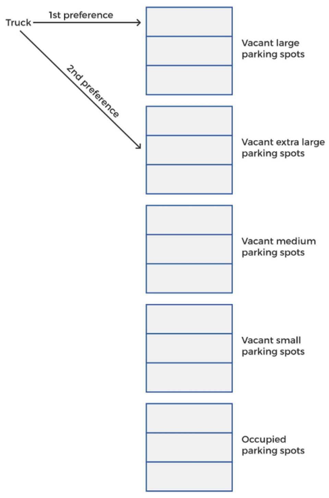
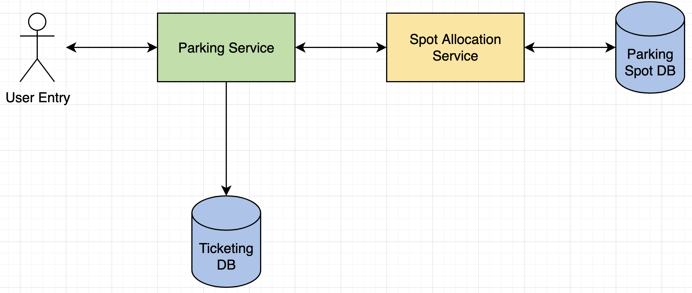
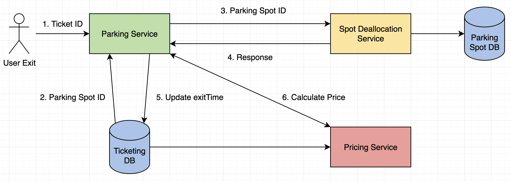
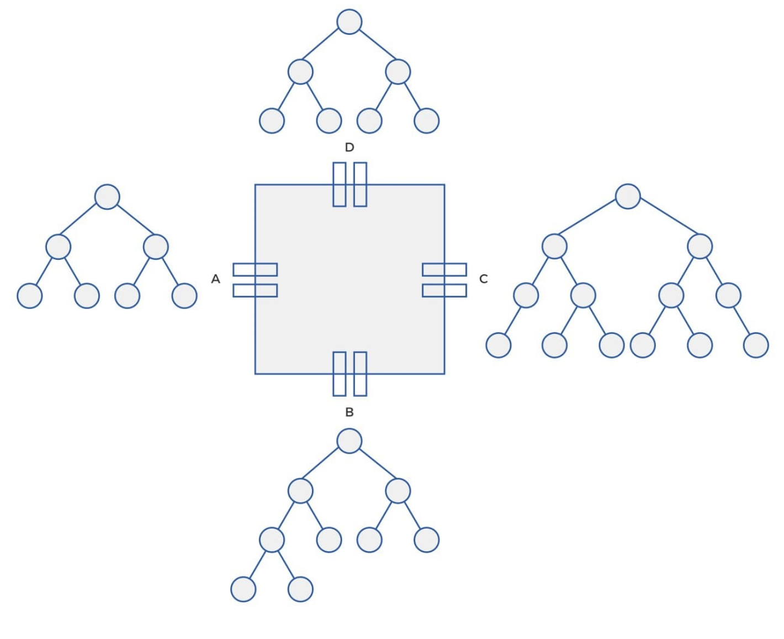

# Parking Lot

## 1. What/Why

- Parking lot is an open area designated for parking cars.
- Certain number of cards can be parked for a certain amount of time.
- Multiple floors with multiple slots, each slot can have a single vehicle.
- Automatic ticketing system so customers can park without any human intervention.

---

## 2. Requirements and Goals of the System

**Functional:**

1. Multiple entry and exit points.
2. Multiple floors available.
3. Each floor carries multiple rows of parking slots.
4. Supports different types of vehicles (motorcycles, cars, buses, etc.)
5. Has motorcycle spots, compact spots, and large spots.
6. Customers can collect parking ticket from entry point and pay at any exit point.

**Non-Functional:**

1. Scale system for 5,000 parking slots.
2. Handle 10,000 parkings per day.
3. Capacity to hold ticketing info for, say, 10 years.

---

## 3. Class Hierarchies/System APIs

**Class Vehicle**

Assume can support 4 different types of vehicles: motorcycle (small), car (medium), truck (large), and bus (extra large). Vehicle class will have the following attributes:

```
licenseNumber: string
color: enum
type: VehicleType, VehicleType = {motorcycle, car, truck, bus}
```

**Class ParkingLot**

Vehicles are parked in a parking lot. ParkingLot class should have a unique identifier called `parkingLotId` to distinguish it from other parking lots:

```
parkingLotId: int
```

Class should also have 2 functions to handle vehicle's entry and exit:

```
// Entry function returns parking ticket
Ticket entry(Vehicle v);

// Exit function returns price amount
double exit(long ticketId);
```

**Class Ticket**

Ticket generated for user when they enter 1 of the entry points, will have an ID to access it. Together with `ticketId`, class also has:

```
ticketId: long
parkingSpotId: long
licenseNumber: string
entryTime: dateTime
exitTime: dateTime
```

**Class ParkingSpot**

Will be allocated to vehicle that enters, so will have an ID so we can occupy it when a car is alloted the spot, and free it when car leaves. Since 4 different sizes of spots, identify it by an attribute `size` with data type `enum` or `int`. Recall 4 sizes: small, medium, large, extra large. Can also have `state` to identify whether spot is "occupied" or "available":

```
parkingSpotId: long
size: enum, {small, medium, large, extraLarge}
state: bool
```

## 4. Database Schema

Each time vehicle comes in, stack of parking spots will be checked for availability and a suitable spot will be assigned. By "suitable" we mean also fits size of vehicle.

**How are parking spots assigned to different vehicle types?**

Ex. Truck comes into parking lot, would be assigned a vacant large spot. If none available, assigned vacant extra large spot. However, can't be assigned a small or medium spot.

So, any vehicle will be allocated a spot for its own size first, then larger spots, but never smaller ones. If none available, system will notify users no spots available.

Similarly, for motorcycle, first try small, then medium, then large, then extra large. For each check, it would check the parking spots database in this increasing order.

With above algorithm in mind, wouldn't be efficient if stored in a single stack, time-consuming. Hence, occupied and available spots can be stored separately, and available spots can be separated into stacks according to size:



**Choosing Database**

With above idea of allocating and freeing parking spots, need DB that offers fast lookups. Hash maps are a good choice of data structure since it's ideal for lookups based on key. Hash maps can be stored in a MySQL DB.

Placing vehicle in spot involves looking up an available parking spot of vehicle's size or larger in the hash maps and changing its state to "occupied".

When want to remove vehicle and free spot, perform lookup in hash map with `ticketId` as key. Lookup returns the `parkingSpotId` for where vehicle was initially parked:

```
// Returns parking spot ID that's now free
parkingSpotId remove(long ticketId);
```

Since spot now free, can change state of this spot to "available".

## 5. High Level Design

System primarily manages 2 functions: vehicle entry and exit. So, break system into 2 parts based on function and design separately.

### **a) Vehicle Entry Design**

- When user comes into parking lot, request goes to Parking Service for entry.
- Parking Service calls Spot Allocation Service to scan Parking Spot DB and pick and allocate a previously vacant spot for this vehicle.
- Parking spot DB is updated and state of spot is changed from "available" to "occupied".
- Spot Allocation Service then returns allocated spot to Parking Service, and Parking Service creates a ticket entry to the Ticketing DB, and finally returns ticket to the user.
- Ticket will carry all the important info, like ticket ID, parking spot ID, and vehicle's license number.



### **b) Vehicle Exit Design**

1. When user want to exit, Parking Service will get ticket ID from user.
2. Parking Service will lookup in Ticketing DB and extract all details for that ticket ID, including parking spot ID.
3. Parking Service makes request to Spot Deallocation Service, with parking spot ID, to deallocate this particular spot in the Parking Spot DB and change its status from "occupied" to "available".
4. Once spot deallocated, Spot Deallocation Service sends response to Parking Service.
5. Parking Service will update the `exitTime` for that ticket in the Ticketing DB.
6. Finally, Parking Service then contacts Pricing Service to calculate the price.



- Pricing Service uses vehicle type and the entry and exit times from Ticketing DB to generate price.
- Parking Service will return price calculated to the user for payment.

## 6. Low Level Design

### **Multiple Entrances**

- Large-scale parking lot can have multiple entrances and exits.
- 1 additional function to add to Spot Allocation Service is to find available spot that's nearest to an entry point.
- Best possible way to achieve this is to use min heaps.
- Can use as many min heaps as number of entrances.
- They'd store parking spots in order of distance from entry points.
- Key for min heaps will be entrance ID, so min heap for each entrance will have parking spots sorted from that particular entrance.



- Example above has 4 entrances, each with their own min heap.
- Parking Service in this case will take entrance ID whenever user enters, and Slot Allocation Service will retrieve min heap for that entrance.
- Element from top of min heap is parking spot ID for nearest parking spot.
- State changed from "available" to "occupied".
- Also, once state changed to "occupied", it's removed from the min heap of all entrance terminals.
