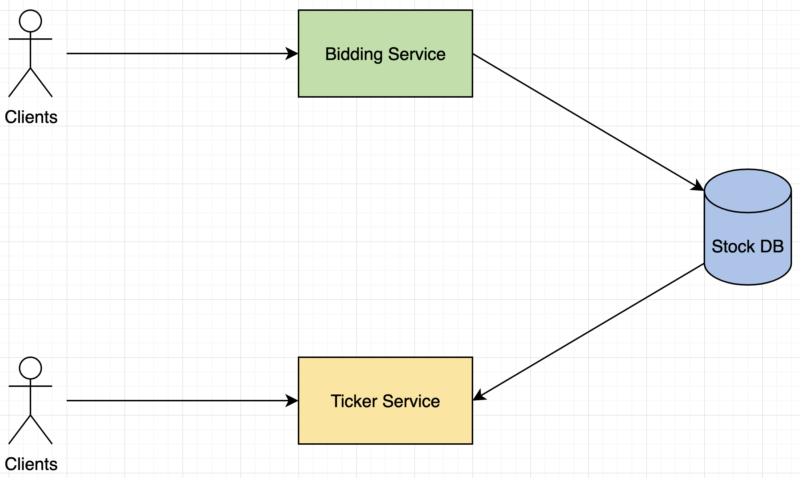
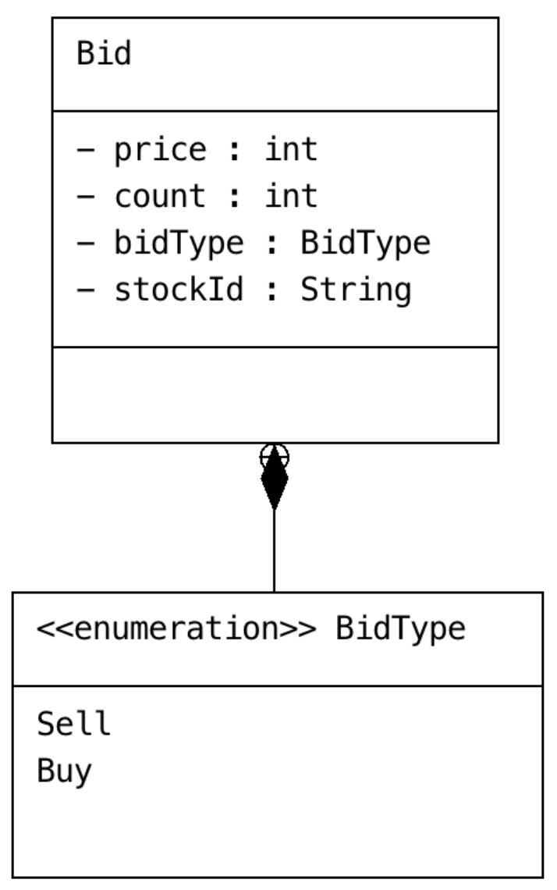
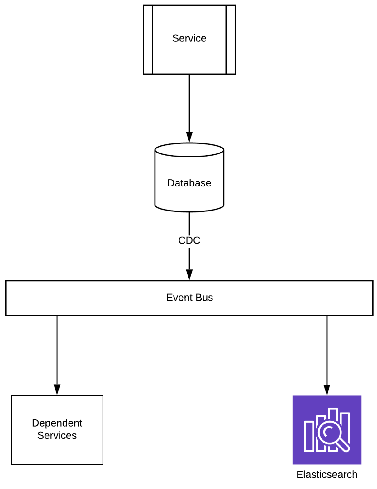
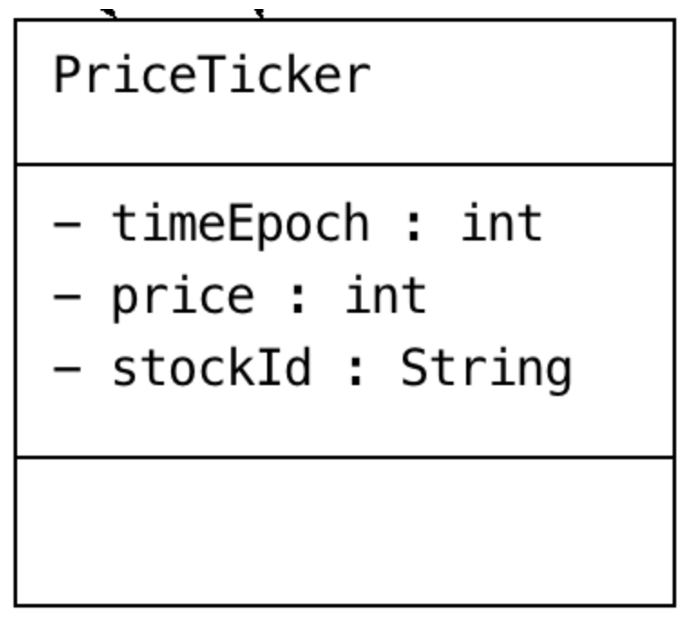
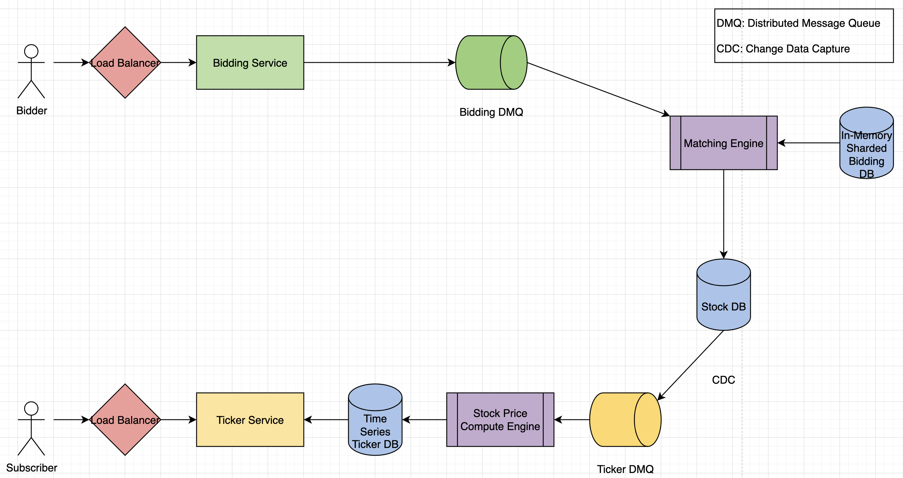

# Stock Exchange

## 1. What/Why

Design a stock exchange like NASDAQ.

---

## 2. Requirements and Goals of the System

- Functional: Depends on question, actual things the system needs to serve its purpose.
- Non-Functional: Ex. highly available (never down), real-time/min latency (fast), highly reliable, scalable, consistency (different data seen by users), trade-offs between these depending on question.

**Functional:**

- Users should be able to bid buy/sell prices for a stock.
- Users should be able to view stocks in real-time and have a historic view of stock price (ticker).
- Compute top 50 best and worst performing stock.
- Publish changes of stock price to subscribers.

**Non-Functional:**

- System should be able to handle 100,000 clients.
- System should be able to handle around 100 million bids/day.
- System should be able to serve prices for stocks with historic view.

---

## 3. Capacity Estimation and Constraints

- Stock exchanges usually busing during the day 9 AM - 5 PM, so serve traffic during the 8-hour window.
- Assume read-to-write ratio is 1:1.

- System should scale around 3,500 queries per second (QPS).
- Bidding system requires around 1 MBps.
- Ticker system requires around 190 MBps.

---

## 4. High Level Design

At a high level, can visualize 2 components needed for the stock exchange:
1. Bidding Service is responsible for taking bids from customers.
2. Ticker Service is responsible for showing current price change of stocks.

---

## 5. Low Level Design

### **Bidding Service**

- Bidding service needs to take the buy/sell bids from users and should be able to find buyers/sellers and complete transactions.
- Need a matching engine which takes incoming buy/sell bids and finds matches with one or more buyers/sellers to execute transactions.
- If it can't find matches, need to store the bid and try to execute transactions once matching bids arrive.

**Bidding Data Model**

### **Ticker Service**

- Ticker service needs to serve clients with latest price of stocks and be able to show historic view based on time.
- Current price of stocks need to be computed from executed transactions from bidding service and stored in a historic price DB.
- Transactions stored in stock DB are then used by ticker service to compute latest price of a stock, can use a design pattern called Change Data Capture.

**Change Data Capture (CDC)**

Design pattern which is used to identify and track changes happening on data, so actions can be taken.

**Log-Based CDC:** Most databases today have transaction logs which keep track of changes happening in the DB, idea is to scan through the logs and identify changes.

- MySQL: Transactions can be logged by enabling bin log and to be read and used.
- HBase: Logs from WAL (write-ahead logging) to capture changes.
- Redis: Append-only persistence feature to read changes happening on the data and relay to interested clients.

**When to use CDC:** Use cases where need to send changes happening in DB to multiple clients through an event bus. Also need to provide full text search feature on the data, so use CDC to power Elasticsearch as well.

**Ticker Data Model**

### **Data Store**

**Bidding Store**

- Should be able to store millions of bids.
- Should be able to store and retrieve data at low-latency and high QPS.
- In-memory sharded data store should be able to satisfy above requirements.

**Stock Transaction Store**

- Should be able to store transactions with ACID (atomicity, consistency, isolation, durability) guarantee.
- Should be able to support multi-transaction commits, in case 1 buy bid is matched with multiple sell bids.
- Can choose any data store with ACID guarantee for this use case.

**Historic Price Store**

- Should be able to store prices of stocks based on time.
- Can choose any store which can provide time-series based retrieval.

### **Final Design**

