# Top k Stocks

## 1. What/Why

Design a system to get the top k stocks throughout the day.

---

## 2. Requirements and Goals of the System

**Functional:**
- `topK(k, startTime, endTime)`

**Non-Functional**:
- Scalable (scales out together with increasing amount of stocks)
- Highly available (survives hardware/network failures, no single point of failure)
- Highly performant (few tens of milliseconds to return top k stocks)
    - Final top k list should be pre-calculated
    - Avoid heavy calculations while calling `topK` API
- Accurate (as accurate as we can get)

---

## 3. Some Design Considerations

Database or distributed cache is not a good option for services of such scale. Even if databases today can handle millions of requests per second, if we count all the stock values for some period of time, how do we calculate the top k? We'd need to scan over all the entries in the database and order entries by value. Expensive and slow.

Big data processing problem? MapReduce might help? Would help, but not enough. Need to return solution as close to real-time as possible.

Also consider different time intervals: top k stocks in the last 1 minute? 5 minutes? 15 minutes? 60 minutes? Since we have all these diff time intervals, turns into a stream processing problem.

---

## 4. Ideas

### **a) Hash Table, Single Host**

- Assume for now all data can be loaded into a single host
- For example, list of events, pair of ({stock, price})
- Every time stock price changes, log such event by updating stock price in the list of events:

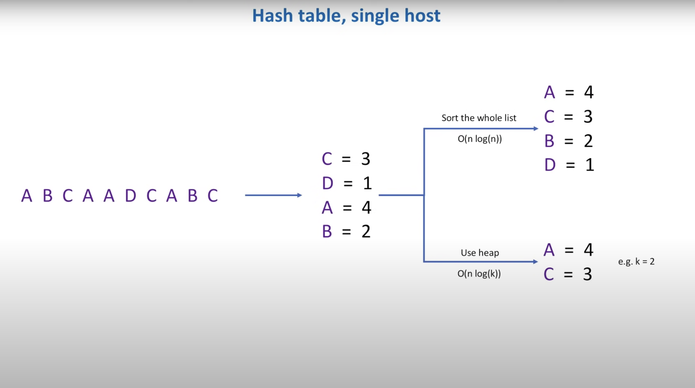

- Given list of events, how do we calculate the k highest elements?
- First, calculate the price of each element in the list
- Create hash table that contains mapping of stock to price
- To get top k elements, can either sort the hash table based on price, or we can add all elements into a heap data structure
- Make sure heap contains only k elements every time we add/update new element
- Heap approach is faster: O(n log n) vs. O(n log k)

### Top k Algorithm - Heap

```
class Solution {
public:
    vector<pair<string, int>> topKFrequent(vector<pair<string, int>>& events, int k) {
        unordered_map<string, int> m;
        for (int i = 0; i < events.size(); i++) {
            m[events[i]]++;
        }
        priority_queue<pair<int, string>, vector<pair<int, string>>, greater<>> pq;
        for (auto it = m.begin(); it != m.end(); it++) {
            pq.push({it->second, it->first});
            if (pq.size() > k) {
                pq.pop();
            }
        }
        vector<pair<string, int>> result;
        while (!pq.empty()) {
            result.push_back({pq.top().second, pq.top().first});
            pq.pop();
        }
        return result;
    }
};
```

### Problem

- Not scalable, if events coming in at a high rate, single host will quickly become a bottleneck
- So, may want to start processing events in parallel

### **b) Hash Table, Multiple Hosts**

- Introduce a load balancer
- Each event then goes to 1 of the hosts in a cluster of hosts:

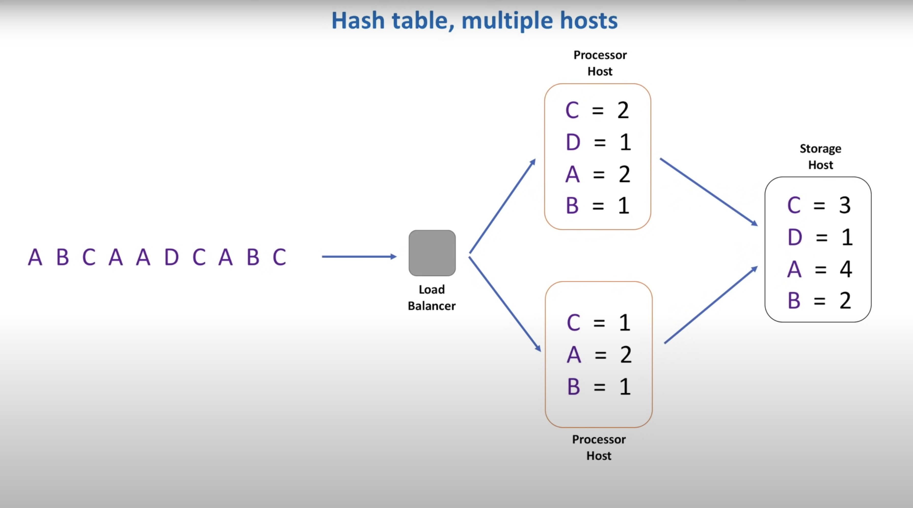

- Because same stock may appear on different processor hosts, each processor needs to flush accumulated data to a single storage host, store with a timestamp and take latest one
- System better now: can process in parallel, total throughput has increased

### Problem

- Memory, may use too much memory on each processor host as well as storage host
- Millions of different stocks, even if we store a fraction of this number in memory, hash table will become huge

### **c) Hash Table, Multiple Hosts, Partitioning**

- Partition data into smaller chunks
- Introduce new component: data partitioner:

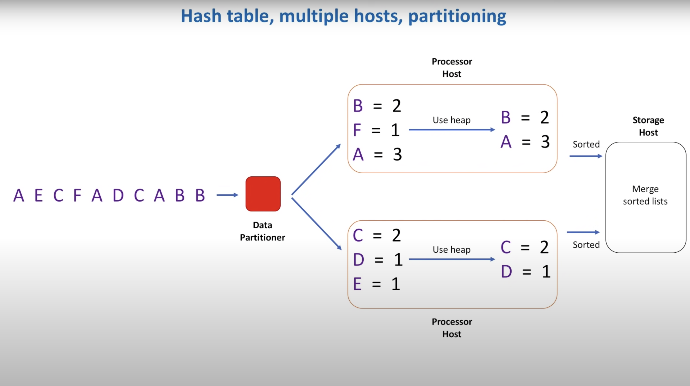

- Responsible for routing each individual stock to its own processor host, so each processor host only stores a subset of all data
- Same process, build hash table, create heap, add from hash table to heap
- Now, each processor host contains its own list of top k stocks, and each list is sorted
- How do we create a final list that combines info from every host? Merge n sorted lists
- Hosts now only pass a list of size k to the storage host, better memory

### Problems

- Have been assuming bounded data sets or data sets of limited size, but streaming data is unbounded, essentially infinite
- Stock prices keep changing every second
- In these cases, processor hosts can accumulate data only for some period of time, say 1 min, and will flush 1 min data to storage host
- We can't store info about every stock in memory

- If we want to know top k stocks for 1 hour or 1 day period, how can we build 1 hour list from 60 1 min list?
- No way to solve this problem precisely
- Since each processor host only send top k list to storage host, we lose data
- We need the whole data set for that hour or that day to calculate a list of top k stocks

- So, on 1 hand, need whole data set for a particular time period, say 1 day
- On the other hand, can't accumulate data in memory for the whole day
- What to do? Store all data on disk and use batch processing framework
- This is where MapReduce comes into play
- A MapReduce program is composed of a map procedure, which performs filtering and sorting (such as sorting students by first name into queues, one queue for each name), and a reduce method, which performs a summary operation (such as counting the number of students in each queue, yielding name frequencies)

- Every time we introduce data partitioning, need to deal with data replication, so that copies of each partition are stored on multiple nodes
- Need to think about rebalancing, when a new node is added to the cluster or removed
- Need to deal with hot partitions

- Is there a simpler solution?
- Yes, but need to make some sacrifices, main sacrifice is accuracy
- Solution to top k stocks with fixed size memory, results not 100% accurate: count-min sketch

### Top k Algorithm - Count-Min Sketch

- Think of it like a 2D-array
- Height represents a number of hash functions
- When a new stock comes or stock price gets updated, calculate each hash function value and add/update the corresponding cell

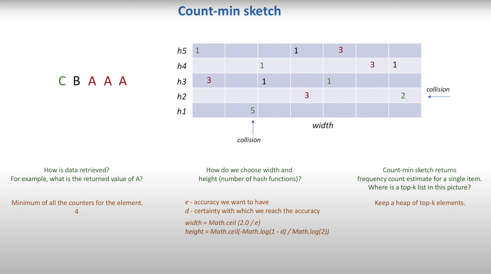

- Ex. stock "A" comes, calculate 5 hash functions based on this stock and it's price
- When another "A" comes, re-calculate each cell value
- When "B" comes, calculate each of "B" cells
- If collision, update cell (where accuracy loss happens)

- Above is how to add data, how do we retrieve data?
- Among all cells for "A", take "least changed" value
- Because of collisions, some cells will contain inaccurate values, so by taking "least changed", minimize loss
- This is why we need several hash functions, because if only 1, more error (more collisions)

- How to apply count-min sketch to our original problem?
- Replacement of hash table
- Still need heap to store top k stocks, but replace hash table that could grow big with count-min sketch that always has a pre-defined size and can never grow in size

---

## 5. High Level Design

- Every time stock price changes, request goes through API gateway, component that represents single-entry point into the stock system
- API gateway routes client requests to backend services
- For our use case, interested in 1 specific function, log generation, when every call to API is logged
- Use these logs to add/update a stock price

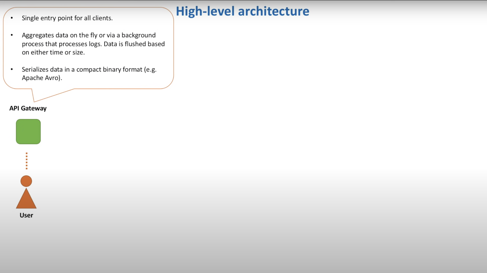

- Data is then sent to a distributed messaging system, like Apache Kafka
- Internally, Kafka splits messages across several partitions, where each partition can be placed on a separate machine in a cluster
- Apache Kafka is a distributed event store and stream-processing platform, aims to provide a unified, high-throughput, low-latency platform for handling real-time data feeds

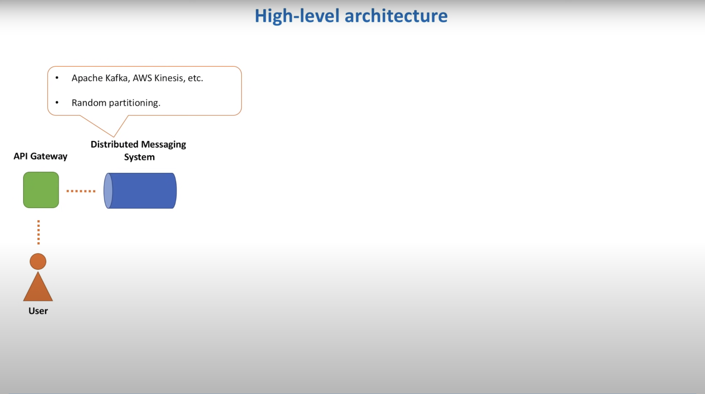

- Now, we will split our data processing pipeline into 2 parts: fast path and slow path
- Fast: calculate list of top k stocks approximately, results available within seconds
- Slow: calculate list of top k stock precisely, results available within minutes or hours

### **a) Fast Path**

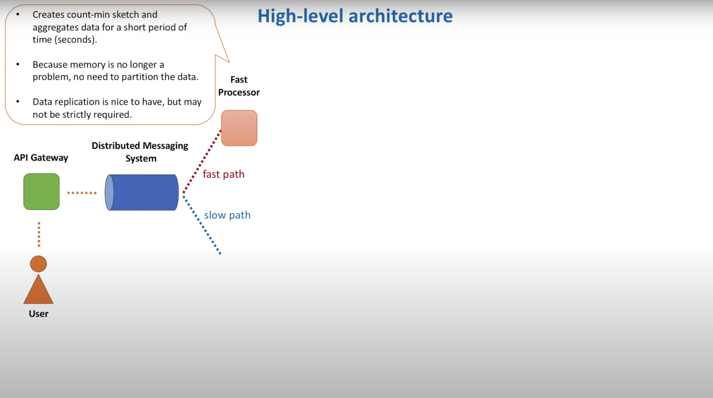

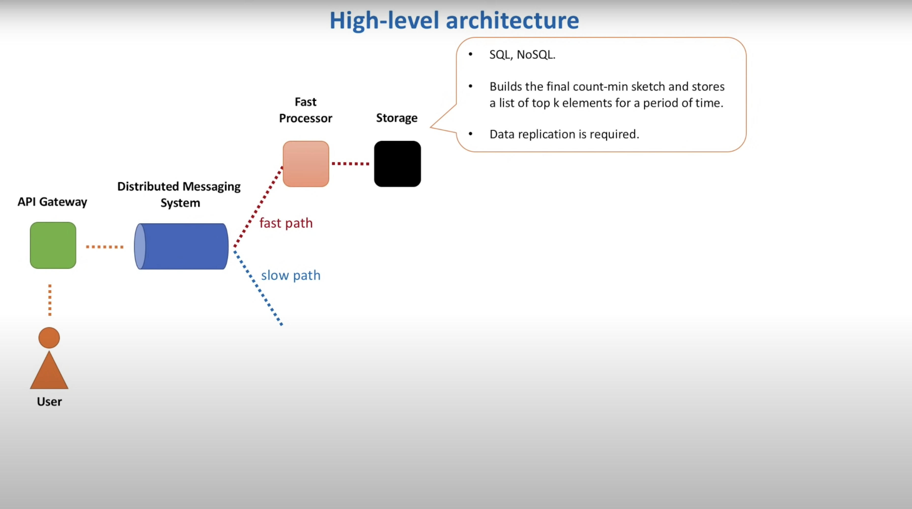

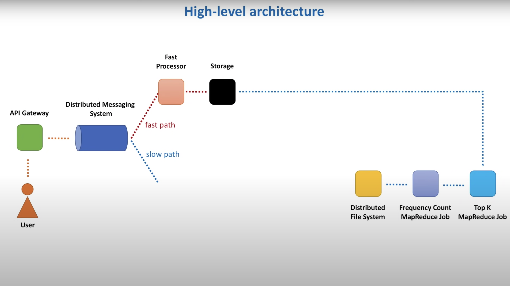

### **b) Slow Path**

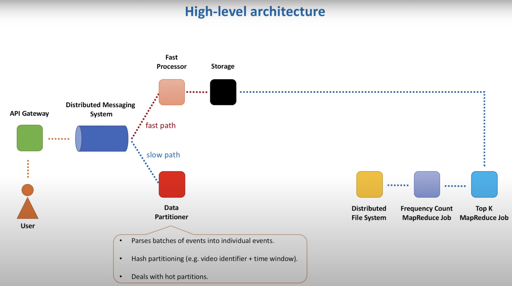

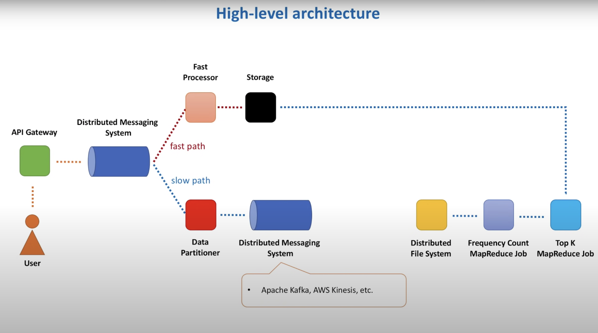

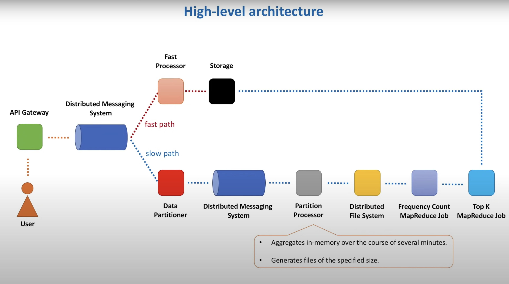

### Which One?

- Ideally, single processing path, but just wanted to show there's 2 ways to go depending on the requirements (how soon top k stocks should be calculated)
- For example, if can tolerate approximate results, forget about slow path, fast path is simple and cheap to build
- If accuracy important and results should be calculated within minutes, we need to partition the data and aggregate in memory
- If time not an issue but still need accurate results, and data set is big, Hadoop MapReduce

---

## 6. Detailed Component Design

### **a) Data Flow, Fast Path**

- A stock is added/updated, and each new stock price is sent to 1 of the API gateway hosts
- Info is then aggregated (hash table on each host) on host and sent to the distributed messaging system
- For each stock, determine it's price within the last several seconds
- Then, fast processor hosts (count-min sketches) pick up and process messages
- After aggregating for several seconds, each host sends info to some storage host, where we build a single count-min sketch

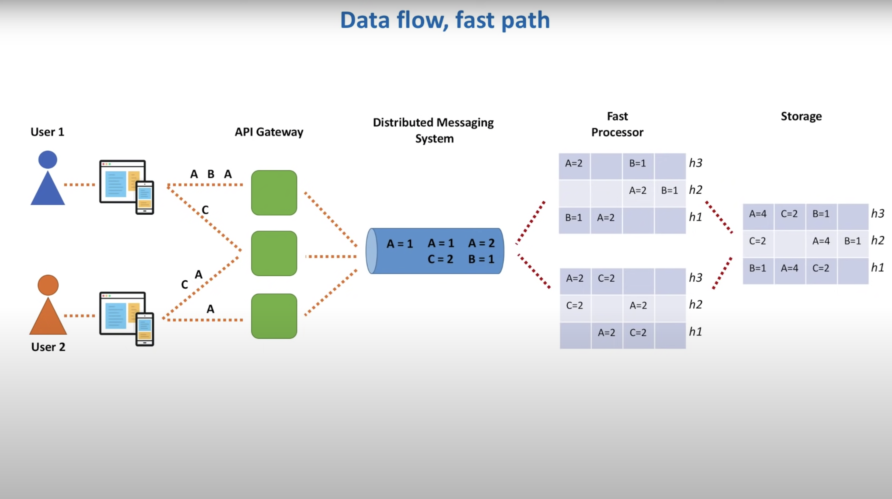

### **b) Data Flow, Slow Path**

- Now we have data partitioner, reads each message and sends info about each video to its own partition
- Then, partition processor to aggregate data for each partition
- Each processor accumulates data in memory for, say 5 mins, and writes it to files stored in distributed file system
- Stock price MapReduce job reads all such 5 minute files and creates a final list per some time interval, say 1 hour
- Top k MapReduce job then uses this info to calculate list of top k stocks for that hour

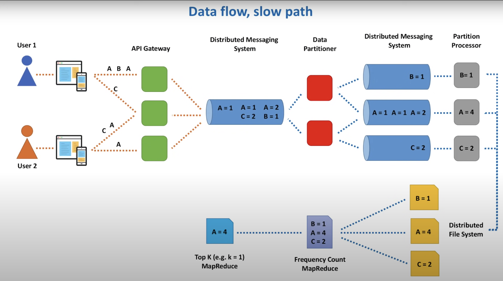

### **c) MapReduce Jobs**

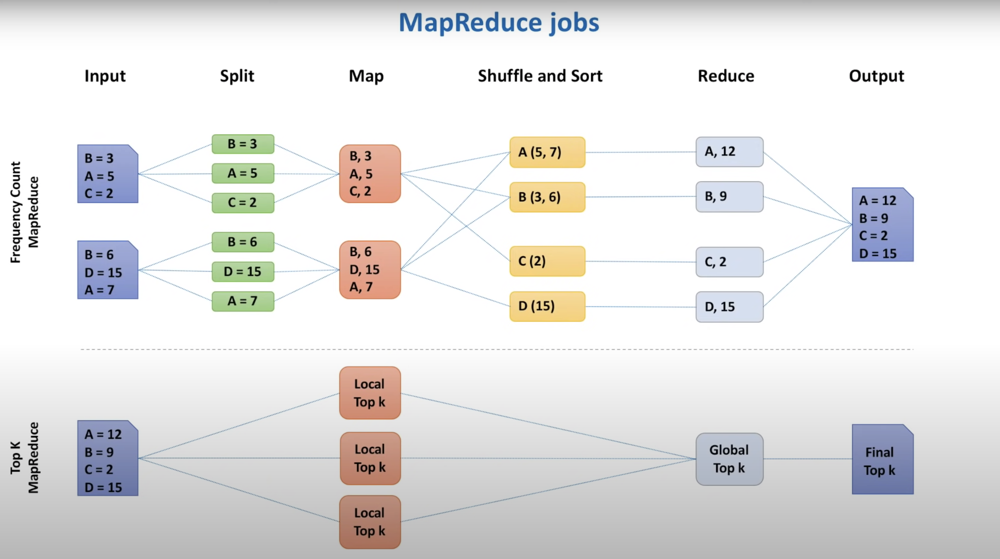

### **d) Data Retrieval**

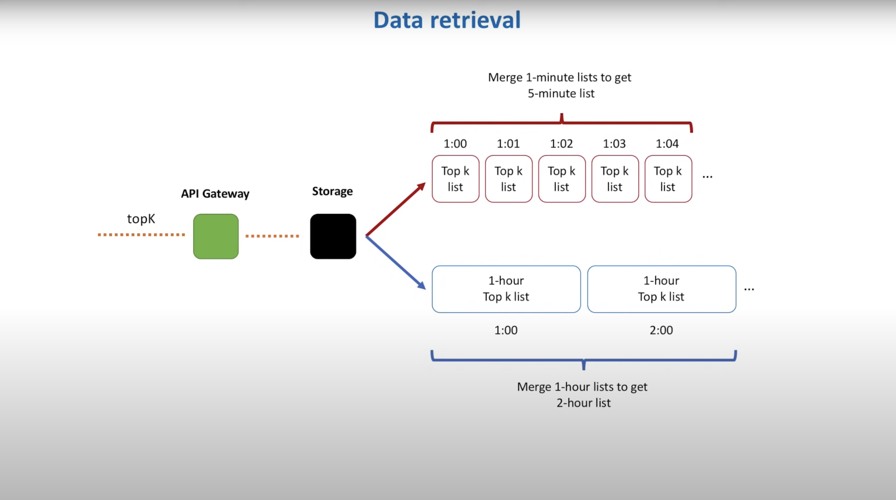
