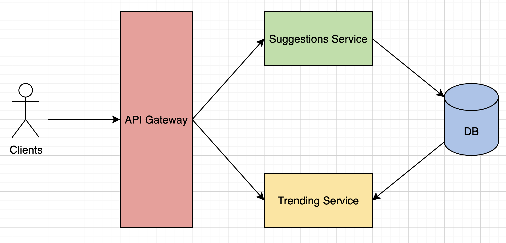
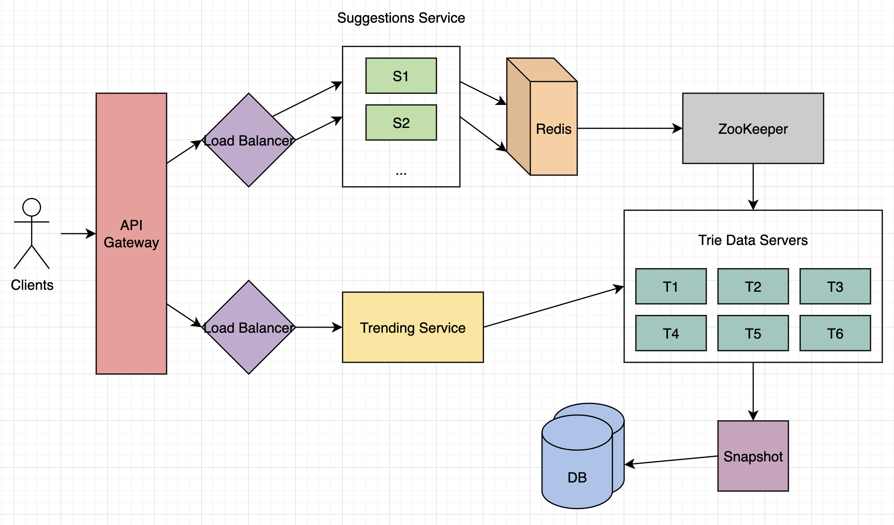
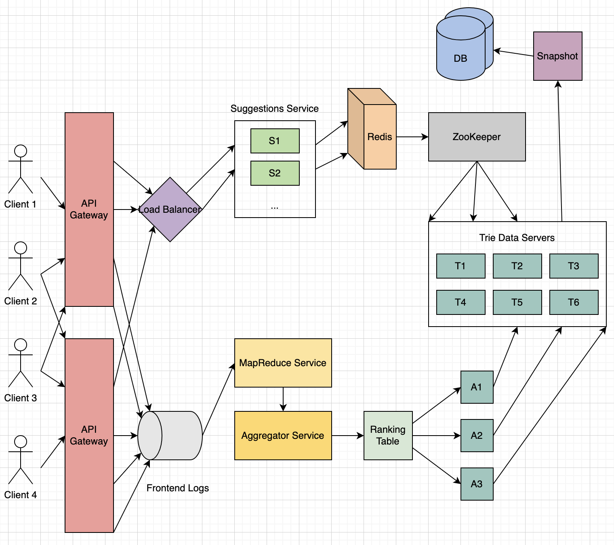

# Typeahead

Real-time suggestion service, which will recommend terms to users as they enter text for searching. Auto-suggestions, typeahead search.

---

## 1. What/Why

- Enable users to search for known and frequently searched terms.
- As users type into search box, tries to predict query based on characters entered and gives list of suggestions.

---

## 2. Requirements

**Functional Requirements:**

- As user types in query, service should suggest top 10 terms starting with whatever user has typed.
- Frequency and recentness of phrase or query used to sort suggestions.

**Non-Functional Requirements:**

- Highly available.
- Suggestions should appear in real-time, user should be able to see suggestions within 200 ms.
- Scalable.

---

## 3. Design Considerations

1. Minimize latency, i.e., relevant suggestions shown while typing.
2. Large amount of data, consider partition tolerance. Cluster must continue to work despite network failures. No performance issues.
3. Service highly available.
4. Okay if don't have strong consistency, eventual consistency is fine. Ex. 2 people see different suggestions for a time span, that's fine. But availability and partition tolerance is important.
5. Search results ordered by some ranking.
6. Results relevant to prefix.

---

## 4. Capacity Estimation

- Assume 5 billion queries per day, or around 60,000 queries per second.
- Estimate 20% of 5 billion searches will be unique (many duplicates), so maybe only want to index top ~50% of search phrases, remove many less often searched queries.
- Assume average query size 15 characters, each query contains average of 3 words and a word has average length 5 characters.
- Assume receive 2% new requests every day, preserver index for previous year, remove old searches.

---

## 5. System APIs

`getSuggestions(prefix)`
- prefix: what user has typed so far when search query is sent.

`addToDB(query)`
- query: new unique trending query which has been searched above certain threshold will be stored in DB.

---

## 6. High-Level Design

2 parts:
1. Giving suggestions.
2. Adding new trending queries to DB.

- When user starts typing, `getSuggestions()` query hits our application servers on every character user enters. Obtains top 10 suggestions from **DB** and serves it to user. Make a service called **Suggestions Service** for this.
- If query is popular, searched above certain threshold, add to DB with `addToDB()`. Make a service called **Trending Service** for this.

Add **API Gateway** as an entry point for clients to send and make requests. Can use AJAX calls for this. AJAX calls are asynchronous calls that can send and receive data without interferring with the display and behavior of the page.

---

## 7. Trie

Since have to serve a lot of queries with minimum latency, need scheme that can efficiently store data such that it can be queried quickly. Can't depend upon some database for this, need to store index in memory in a highly efficient data structure.

One of the most appropriate data structures for this is the Trie. Tree-like data structure used to store phrases where each node stores a character of the phrase in a sequential manner. For example, if need to store 'cap, cat, caption, captain, capital' in the trie:

Now if user typed 'cap', service can traverse trie to go to node 'P' to find all terms that start with this prefix (e.g., cap-tion, cap-ital).

Can merge nodes that only have 1 branch to save storage space:

**How to find top suggestions?**

How to find top 10 terms for a given prefix? 1 simple solution could be to store count of searches that terminated at each node, e.g., if users have searched about 'CAPTAIN' 100 times and 'CAPTION' 500 times, store this number with the last character of the phrase. So, to find top suggestions, traverse subtree.

**Given a prefix, how much time will it take to traverse its subtree?**

- O(l): time to go to the prefix node.
- O(n): time to find all possible nodes under prefix node.
- O(k log k): time to sort top k suggestions by highest frequencies.

Given amount of data we need to index, expect huge tree. Since we have very strict latency requirements, do need to improve efficiency.

**Can we store top suggestions with each node?**

- Precompute suggestion results and store at each node.
- Now time complexity becomes just O(l), as we have moved O(n) and O(k log k) to the precomputation stage.
- Problem: Much higher storage requirement, but consider that storage is more afforable than providing late results.
- Can optimize by storing only references of the terminal nodes rather than storing the entire phrase.

- How to store this precomputed data?
- Hash table with prefix as key and list of suggestions as value.
- Store hash table in a cache like **Redis** to further optimize.

| Prefix | Suggestions |
| ------ | ----------- |
| C | CAPITAL (50), CAPTAIN (40), CAT (30), ... |
| CA | CAPITAL (50), CAPTAIN (40), CAT (30), ... |
| CAP | CAPITAL (50), CAPTAIN (40), CAPTION (20) |
| CAPT | CAPTAIN (40), CAPTAIN (30) |

---

## 8. Storage of Trie

**How to store trie in a file so that we can rebuild our trie easily?** 

- Take snapshot of trie periodically and store it in a file. This enables us to rebuild a trie if server goes down.
- To store, can start with root node and save the trie level-by-level.
- Ex. `{C1, A2, P2, T, T2, I1, I1, A1, T1, O1, I1, A1, N, N, L}`.

**How would we build this trie?**

Bottom up, each parent node recursively calls all child nodes to calculate their top suggestions and counts.

**How to update trie?**

If we try to update our trie for every query, it'll be extremely resource intensive. 1 solution could be to update our trie offline after a certain interval.

Can have a MapReduce (MR) setup to process all logging data periodically, say every hour. These MR jobs calculate frequencies of all searched terms in the past hour. Can then update trie with this new data. Have 2 options:

1. Make a copy of the trie on each server to update it offline. Once done, can switch to start using it and discard old one.
2. Have master-slave configuration for each trie server. Can update slave while master is serving traffic. Once update complete, can make slave our new master.

**How can we update frequencies of typeahead suggestions?**

- Ex. for last 10 days, deduct counts from time periods no longer included, and add counts for new periods.
- Can add and subtract frequencies based on Exponential Moving Average of each term, giving more weight to latest data.
- After inserting new term in trie, go to terminal node of phrase and increase its frequency.

**What could be different ranking criteria for suggestions?**

Freshness, user location, language, demographics, personal history, etc.

---

## 9. Data Partitioning

Although index can easily fit on 1 server, can still partition (sharding) to meet requirements of higher efficiency and lower latencies. Few options:

### **a. Partition based on range**

Store phrases in separate partitions based on 1st letter. So, save all terms starting with letter 'A' in 1 partition, and those with 'B' in another partition, and so on.

Main problem with this approach is can lead to unbalanced servers, for instance, many queries may start with 'A' vs. less frequent 'X'.

### **b. Partition based on maximum capacity of server**

Let's say partition our trie based on max memory capacity of servers. Keep storing data on a server as long as it has memory available. For example, 1st trie server stores all terms from 'A' to 'AABC', next server 'AABD' onwards. If 2nd server stores up to 'BXA', next server 'BXB' and so on. Can keep a hash table for this:

- Server 1: A-AABC
- Server 2: AABD-BXA
- Server 3: BXB-CDA

Can have load balancer in front of trie servers which can store this mapping and redirect traffic.

Partitioning based on max capacity can still lead to hotspots, e.g., if there are a lot of queries for terms starting with 'cap', server holding it will have high load.

### **c. Partition based on hash of the term**

Each term passed to a hash function, which generates a server number to store term in. This will make our term distribution random and hence minimize hotspots. Ex. `generatedHash % number of shards`.

Disadvantage is, to find typeahead suggestions for a term, have to ask all the servers and then aggregate and sort the results.

### Choose Option b.

- Aggregating from few servers is better than aggregating results from each server.
- Use mapping to see which server stores which range of prefix.
- What can we use? **ZooKeeper**.
    - Coordinates cluster and maintains shared data between them.
    - Continuously checks health of trie servers.
    - Highly available, good with lots of reads/some writes.

---

## 10. Caching

- Caching top searched terms will be extremely helpful.
- Can have separate cache servers in front of trie servers holding most frequently searched terms and typehead suggestions.
- Application servers should check cache servers before hitting trie servers.
- Use Redis.
- Use LRU caching strategy, keep recent queries, evict old ones.

---

## 11. Mid-Level Design

---

## 12. Suggestions Service

1. T1, T2 are 2 different servers, holding replicas of single tries for availability. Similar for T3-T4 and T5-T6.
2. ZooKeeper entry:
    `{a-fr -> T1, T2 | fs-ol -> T3, T4 | om-z -> T5, T6}`
3. Load Balancer delegates requests to Suggestions Service.
4. Let's say a request with prefix "cap" is routed to S1.
5. S1 first looks in distributed cache (Redis) to fetch data. Since first request, will be a cache miss.
6. S1 calls ZooKeeper to check who owns "cap".
7. ZooKeeper returns T5, T6.
8. S1 randomly picks node (suppose T5) and fetches data: `{CAPITAL, CAPTAIN, CAPTION}`.
9. S1 stores this data in Redis.

---

## 13. Trending Service

1. Say given log of queries and weight until a certain timestamp. Weight can be decided based on frequency.

| Query | Time | Weight |
| ----- | ---- | ------ |
| CAP | May 17: 12-1 PM | 100 |
| CAPTAIN | May 17: 1-2 PM | 80 |
| CAPITAL | May 17: 2-3 PM | 90 |
| CAT | May 16 | 70 |

Say we aggregate data on hourly basis. Why? To give more weight to more recent data and favor that over stale old queries. Introduce **MapReduce Service** to process all logging data every hour, and calculate frequencies.

2. **Aggregator Service** then aggregates data from different log services and calculates new ranking scores.

3. Take data from **Ranking Table** and add it to Trie Servers. Call these Appliers.
- Assume 3 appliers:
    - A1 -> a-fr
    - A2 -> fs-ol
    - A3 -> om-z
- Takes queries, applies weight, build trie internally where every node will have top k terms, dump into respective trie servers.

4. Updating our trie servers has to be done offline, can use master-slave configuration. Master will server traffic, update slave, once updating is complete, slave becomes new master.

---

## 14. Low-Level Design

